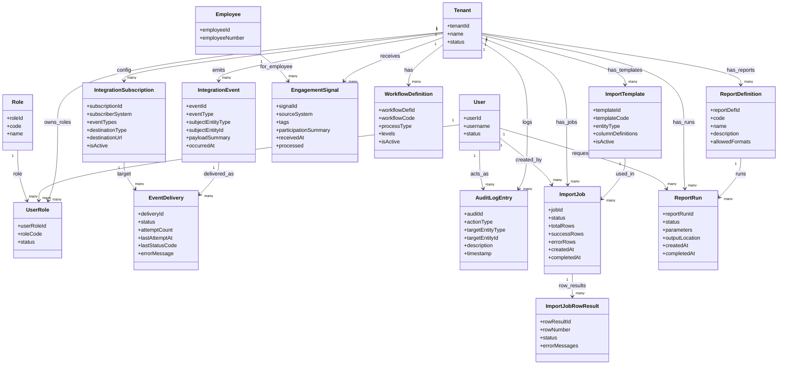

## 1. Entities for “Integrations & Non-functional” Domain

### 1.1 Tenant (`SYS_TENANT` / `TEN`)

**Purpose**

* Represent a customer/organisation using PeopleWell.
* Act as the main **multi-tenancy boundary** for all tenant-scoped data.
* Drive config such as enabled modules, integration endpoints, and default roles.

**Key attributes (business-level)**

* Tenant ID
* Tenant name, code
* Status (Active / Suspended / Trial / Closed)
* Country / locale / default timezone
* Feature flags / enabled modules (wellness, performance, gamification, etc.)
* Created/activated dates

**Multi-tenant?**

* **Global** (not tenant-scoped); all other tenant data references it.

---

### 1.2 User (`SYS_USER` / `USR`)

**Purpose**

* Represent a login identity in PeopleWell (one person may have one or more logins across tenants if needed).
* Anchor authentication and base authorization before tenant/role scopes are applied.

**Key attributes**

* User ID
* Username / email (login identifier)
* Password hash or external IdP subject reference
* Status (Active / Locked / Disabled)
* Last login at, failed attempts
* Optional global person reference (→ `PID_PERSON`)

**Multi-tenant?**

* Typically **global**; tenant membership is via `UserRole`.

---

### 1.3 Role (`SYS_ROLE` / `ROL`)

**Purpose**

* Represent a named role such as Employee, Manager, HR, Admin, Exec.
* Provide the base building blocks for RBAC.

**Key attributes**

* Role ID
* Role code (e.g. `EMPLOYEE`, `MANAGER`, `HR`, `ADMIN`, `EXEC`)
* Role name, description
* Is system role or tenant-custom role flag

**Multi-tenant?**

* Often **global** for system roles; tenant-specific overrides/custom roles may be supported (then include tenant reference).

---

### 1.4 UserRole (`SYS_USER_ROLE` / `URL`)

**Purpose**

* Link Users to Tenants and Roles, enabling **tenant-level role assignments**.
* Capture per-tenant RBAC membership and scope.

**Key attributes**

* User-role ID
* Tenant reference (→ `SYS_TENANT`)
* User reference (→ `SYS_USER`)
* Role reference (→ `SYS_ROLE`)
* Optional org scope (e.g. root Org Unit, if HR role is limited)
* Status (Active / Inactive)
* Effective-from / effective-to dates

**Multi-tenant?**

* **Yes** – tenant-scoped (each row belongs to a tenant).

---

### 1.5 IntegrationEvent (`INT_EVENT` – conceptual)

Supports PW-INT-01.

**Purpose**

* Represent an **outbound business event** raised by PeopleWell that may be delivered to ZHEP or other subscribers.
* Capture key wellness-related moments: appraisal completion (with wellness commitments), leave approvals (with wellness indicators), wellness check-in signals.

**Key attributes**

* Integration event ID
* Tenant reference (→ `SYS_TENANT`)
* Event type (e.g. `APPRAISAL_COMPLETED`, `LEAVE_APPROVED`, `CHECKIN_WELLNESS_SIGNAL`)
* Subject entity type (e.g. `PERF_APPRAISAL`, `LEAVE_REQUEST`, `CHECKIN`)
* Subject entity ID
* Event payload (serialized summary) – must be non-clinical and privacy-safe
* Occurred at timestamp
* Created at timestamp

**Multi-tenant?**

* **Yes** – events are emitted within a tenant boundary.

---

### 1.6 EventDelivery / WebhookDelivery (`INT_EVENT_DELIVERY` – conceptual)

**Purpose**

* Track delivery attempts of IntegrationEvents to external consumers (e.g. ZHEP, other webhooks).
* Support retries, status, and diagnostics.

**Key attributes**

* Event delivery ID
* Integration event reference (→ IntegrationEvent)
* Target system reference (e.g. ZHEP, third-party, internal subscriber)
* Target endpoint URL
* Status (Pending / Delivered / Failed / Retrying)
* Last attempt timestamp, attempt count
* Last response status code, error message (if any)

**Multi-tenant?**

* **Yes** – inherits tenant via the IntegrationEvent.

---

### 1.7 IntegrationSubscription / WebhookSubscription (`INT_SUBSCRIPTION` – conceptual)

**Purpose**

* Represent configured subscriptions to specific event types (e.g. ZHEP wants wellness events).
* Provide the link between tenants and destinations (URLs, queues, etc.).

**Key attributes**

* Subscription ID
* Tenant reference (→ `SYS_TENANT`)
* Subscriber system name (e.g. `ZHEP`)
* Subscribed event types (list or separate rows)
* Destination type (Webhook, Queue, Internal handler)
* Destination URL / connection info
* Active flag
* Created/updated metadata

**Multi-tenant?**

* **Yes** – per-tenant subscriptions.

---

### 1.8 EngagementSignal (`INT_ENGAGEMENT_SIGNAL` – conceptual)

Supports PW-INT-02 and links to `PID_WELLNESS_PROFILE`.

**Purpose**

* Represent **incoming engagement signals** from ZHEP such as tags or participation summaries.
* Provide an audit/history trail for what was received before updating the Employee’s WellnessProfile.

**Key attributes**

* Engagement signal ID
* Tenant reference (→ `SYS_TENANT`)
* Employee reference (→ `PID_EMPLOYEE`)
* Source system (e.g. `ZHEP`)
* Engagement tags (opaque labels; high-level, non-clinical)
* Participation summary (e.g. programs joined/completed)
* Received at timestamp
* Processed flag/status

**Multi-tenant?**

* **Yes**

> The **current tags used in the app** still live primarily on `PID_WELLNESS_PROFILE`; this entity is the “raw inbound log”.

---

### 1.9 AuditLogEntry (`SYS_AUDIT_LOG` / `ADL` – conceptual)

Supports PW-NFR-04.

**Purpose**

* Record sensitive changes such as contract updates, overrides, manual leave adjustments, appraisal overrides.
* Provide an immutable audit trail for compliance and troubleshooting.

**Key attributes**

* Audit log entry ID
* Tenant reference (→ `SYS_TENANT`)
* Actor user reference (→ `SYS_USER`)
* Action type (e.g. `CONTRACT_CHANGE`, `LEAVE_BALANCE_ADJUSTMENT`, `APPRAISAL_OVERRIDE`)
* Target entity type and ID
* Description / reason (if provided)
* Before/after snapshot (optional, or at least changed fields)
* Timestamp
* Source channel (ESS/MSS/Admin API)

**Multi-tenant?**

* **Yes**

---

### 1.10 WorkflowDefinition (`SYS_WORKFLOW_DEF` / `WFD` – conceptual)

Supports PW-NFR-08/09 for **basic approval workflows**.

**Purpose**

* Represent a **simple, configurable workflow** for a business process (e.g. Leave approval, Appraisal approval).
* Store configuration for steps without requiring a full BPM engine.

**Key attributes**

* Workflow definition ID
* Tenant reference (→ `SYS_TENANT`)
* Workflow code (e.g. `LEAVE_APPROVAL_DEFAULT`, `APPRAISAL_FLOW_H1`)
* Process type (Leave / Appraisal / Other – code)
* Number of levels (e.g. 1 or 2)
* Default behaviour flags (e.g. require HR approval for certain leave types)
* Active flag

**Multi-tenant?**

* **Yes**

> Individual steps (Manager, HR) may be implicit (based on roles) and not require separate `WorkflowStep` entity in MVP.

---

### 1.11 ImportTemplate (`SYS_IMPORT_TEMPLATE` / `IMT` – conceptual)

Supports PW-NFR-10 (Excel/CSV templates).

**Purpose**

* Define the structure of CSV/Excel imports for key entity types (Employees, Org Units, Positions, etc.).
* Provide documentation of required/optional columns and validation rules.

**Key attributes**

* Import template ID
* Tenant reference (→ `SYS_TENANT`) or global (for standard templates)
* Template code (e.g. `EMPLOYEES`, `ORG_UNITS`, `POSITIONS`, `LEAVE_BALANCES`, `PERF_TEMPLATES`)
* Entity type / domain
* Column definitions (name, mapping to field, required/optional flags, type hints)
* Version / active flag

**Multi-tenant?**

* **Global or Tenant-scoped**; default templates can be global, tenants may override.

---

### 1.12 ImportJob (`SYS_IMPORT_JOB` / `IMJ`)

Supports PW-NFR-11.

**Purpose**

* Represent a single execution of an import (file upload).
* Track validation status, error messages and re-uploads.

**Key attributes**

* Import job ID
* Tenant reference (→ `SYS_TENANT`)
* Template reference (→ ImportTemplate)
* Uploaded file reference/location
* Status (Uploaded / Validating / Completed / CompletedWithErrors / Failed)
* Total rows, success row count, error row count
* Created by user reference (→ `SYS_USER`)
* Created at / completed at timestamps

**Multi-tenant?**

* **Yes**

---

### 1.13 ImportJobRowResult (`SYS_IMPORT_ROW` / `IMR` – optional but implied)

**Purpose**

* Store row-level validation feedback and error messages.
* Enable “download error report, fix, and re-upload” behaviour.

**Key attributes**

* Row result ID
* Import job reference (→ ImportJob)
* Row number
* Parsed key field(s) (for easier tracing)
* Status (Valid / Error / Skipped)
* Error messages (possibly multiple; could be a concatenated string)

**Multi-tenant?**

* **Yes**, via ImportJob.

---

### 1.14 ReportDefinition (`SYS_REPORT_DEF` / `RPD` – conceptual)

Supports PW-NFR-12/13.

**Purpose**

* Represent curated reports (e.g. headcount by Org Unit, leave summaries, Recovery Index summaries).
* Define parameters and output structure.

**Key attributes**

* Report definition ID
* Tenant reference (→ `SYS_TENANT`) or global (standard library)
* Code (e.g. `EMP_HEADCOUNT_BY_UNIT`, `LEAVE_USAGE_BY_TYPE`, `RECOVERY_INDEX_BY_UNIT`)
* Name, description
* Domain(s) involved (People, Leave, Performance, Gamification)
* Default filters/parameters (date ranges, org scope, etc.)
* Export formats allowed (CSV, Excel)

**Multi-tenant?**

* **Global or Tenant-scoped**.

---

### 1.15 ReportRun (`SYS_REPORT_RUN` / `RPR`)

**Purpose**

* Represent one execution of a report for a particular tenant & parameter set.
* Track who ran it, when, and how to retrieve the output file.

**Key attributes**

* Report run ID
* Tenant reference (→ `SYS_TENANT`)
* Report definition reference (→ ReportDefinition)
* Requested by user (→ `SYS_USER`)
* Execution time window (from/to) or parameter payload
* Status (Queued / Running / Completed / Failed)
* Output location (file link)
* Created at / completed at timestamps

**Multi-tenant?**

* **Yes**

---

## 2. Relationships (Integrations & Non-functional)

Using `A (1) -- (many) B` to represent one-to-many.

### Multi-tenancy & RBAC

1. **Tenant – UserRole**
   `Tenant (1) -- (many) UserRole`

2. **User – UserRole**
   `User (1) -- (many) UserRole`

3. **Role – UserRole**
   `Role (1) -- (many) UserRole`

4. **Tenant – IntegrationEvent**
   `Tenant (1) -- (many) IntegrationEvent`

5. **Tenant – EngagementSignal**
   `Tenant (1) -- (many) EngagementSignal`

6. **Tenant – AuditLogEntry**
   `Tenant (1) -- (many) AuditLogEntry`

7. **User – AuditLogEntry**
   `User (1) -- (many) AuditLogEntry`

8. **Tenant – WorkflowDefinition**
   `Tenant (1) -- (many) WorkflowDefinition`

9. **Tenant – ImportTemplate**
   `Tenant (1) -- (many) ImportTemplate` (or null for global templates)

10. **Tenant – ImportJob**
    `Tenant (1) -- (many) ImportJob`

11. **ImportJob – ImportJobRowResult**
    `ImportJob (1) -- (many) ImportJobRowResult`

12. **Tenant – ReportDefinition**
    `Tenant (1) -- (many) ReportDefinition` (or null for global)

13. **Tenant – ReportRun**
    `Tenant (1) -- (many) ReportRun`

14. **ReportDefinition – ReportRun**
    `ReportDefinition (1) -- (many) ReportRun`

---

### Integrations & events

15. **IntegrationEvent – EventDelivery**
    `IntegrationEvent (1) -- (many) EventDelivery`

16. **Tenant – IntegrationSubscription**
    `Tenant (1) -- (many) IntegrationSubscription`

17. **IntegrationSubscription – EventDelivery**
    `IntegrationSubscription (1) -- (many) EventDelivery`

    * Each subscription gets its own deliveries for events of interest.

18. **Employee – EngagementSignal**
    `Employee (1) -- (many) EngagementSignal`

    * Signals from ZHEP, later merged into WellnessProfile.

---

### Imports & reporting

19. **ImportTemplate – ImportJob**
    `ImportTemplate (1) -- (many) ImportJob`

20. **User – ImportJob**
    `User (1) -- (many) ImportJob`

21. **User – ReportRun**
    `User (1) -- (many) ReportRun`

---

### Cross-domain targets (logical, not hard FKs)

22. **IntegrationEvent – other domain entities**

    * `IntegrationEvent` references `LEA_LEAVE_REQUEST`, `PRF_PERF_APPRAISAL`, `PRF_CHECKIN`, etc. via `(subjectEntityType, subjectEntityId)` pairs.

23. **AuditLogEntry – other domain entities**

    * `AuditLogEntry` references changed entities (e.g. `PID_EMP_CONTRACT`, `LEA_LEAVE_BALANCE`, `PRF_PERF_APPRAISAL`) via `(targetEntityType, targetEntityId)`.

24. **WorkflowDefinition – processes in other domains**

    * `WorkflowDefinition`’s `processType` ties it to e.g. Leave or Appraisal; the actual state is primarily on the domain entities (`LEA_LEAVE_REQUEST.status`, `PAP.status`).

---

## 3. Cross-domain / Overlap Flags

* **Tenant, User, Role, UserRole**

  * Form the core **System / Shared** domain; they underpin all other bounded contexts.

* **EngagementSignal**

  * Integration domain; writes into People Core’s `PID_WELLNESS_PROFILE` over time.
  * Might be merged into a more general “InboundMessage” pattern later.

* **IntegrationEvent, EventDelivery, IntegrationSubscription**

  * Clearly belong to an **Integration/Events** subdomain, reusable beyond ZHEP (for other webhooks, downstream services).

* **AuditLogEntry**

  * System-wide logging; referenced by multiple domains.

* **WorkflowDefinition**

  * Implementation detail of “basic configurable workflows”; can be reused by Leave & Performance domains.

* **ImportTemplate / ImportJob / ImportJobRowResult**

  * System-level **Onboarding / Data Load** domain, but keyed to tenants.

* **ReportDefinition / ReportRun**

  * System-level **Reporting** domain that aggregates across People, Org, Leave, Performance, Gamification.

None of these overlap strongly enough to be merged with core business domains; they are platform concerns that should stay separate.

---

## 4. Mermaid Class Diagram (Integrations & NFR Domain View)

This gives you a clean platform/integration domain to anchor:

* **ZHEP events & signals**,
* **RBAC**,
* **Audit**,
* **Workflows**,
* **Imports**, and
* **Reporting**

…all without polluting the core HR/Leave/Perf schemas.
