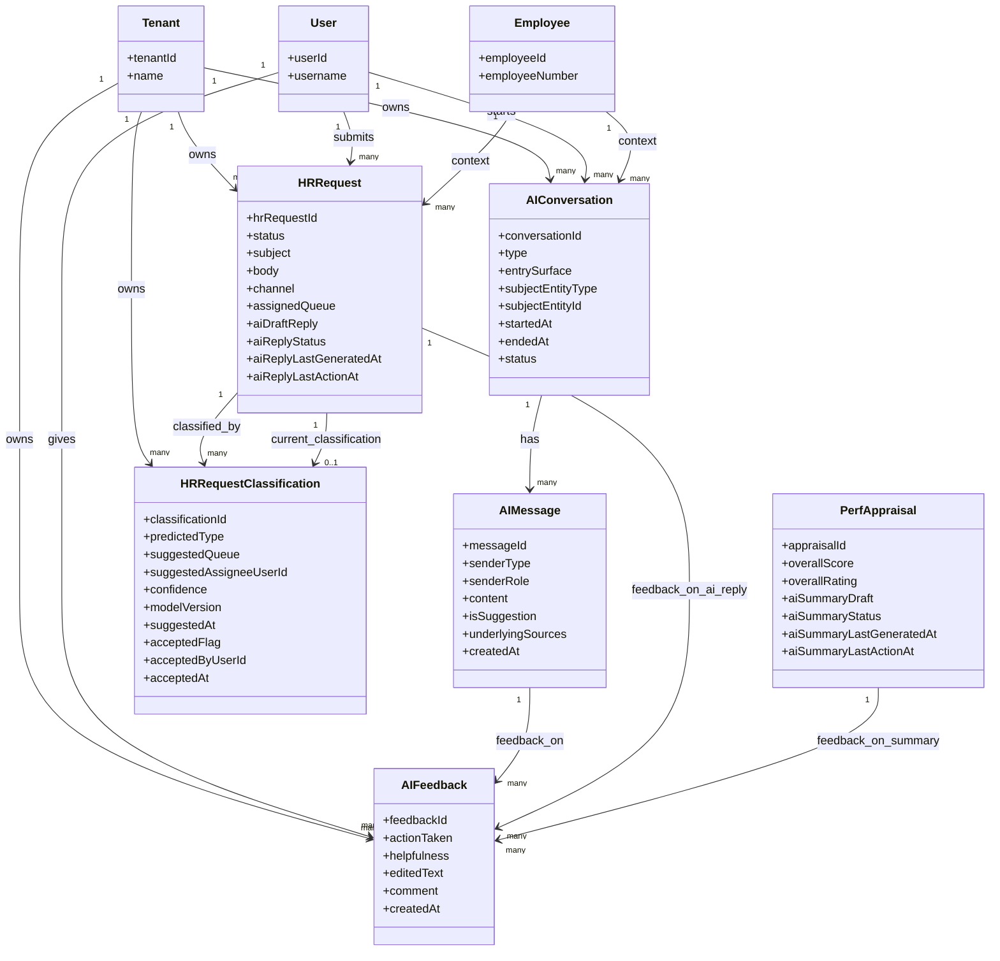

# AI Layer - MermaidER Domain Diagram

## Domain Overview

The AI Layer provides AI-powered assistance features including conversational AI (copilots), HR request classification and routing, performance appraisal summarization, and feedback collection. It enhances user experience with intelligent automation while maintaining human-in-the-loop principles for critical decisions.

## Mermaid Class Diagram

## Key-Value Mappings

### Entity Mappings

| Entity | Purpose | Client-Side Representation |
|--------|---------|---------------------------|
| `Tenant` | Multi-tenant isolation | Company-specific AI configurations |
| `User` | AI interaction initiator | User name in conversations, request submitter |
| `Employee` | Context for AI interactions | Employee profile context, related data access |
| `PerfAppraisal` | Appraisal summarization target | Appraisal detail page with AI summary section |
| `HRRequest` | HR request for AI assistance | Request form, request detail with AI draft reply |
| `AIConversation` | Conversation session | Chat interface, conversation history |
| `AIMessage` | Individual messages | Message bubbles in chat, message history |
| `HRRequestClassification` | AI classification results | Classification suggestions, routing recommendations |
| `AIFeedback` | User feedback on AI | Feedback buttons, feedback forms, improvement tracking |

### Relationship Mappings

| Relationship | Meaning | User Experience Impact |
|--------------|---------|------------------------|
| `Tenant → AIConversation` | Company owns conversations | Each company's AI conversations are isolated |
| `User → AIConversation` | User starts conversations | User sees their own conversation history |
| `Employee → AIConversation` | Conversations have employee context | AI understands employee-specific context |
| `AIConversation → AIMessage` | Conversations contain messages | Chat interface shows message thread |
| `User → HRRequest` | User submits HR requests | User sees their own HR requests |
| `Employee → HRRequest` | Requests have employee context | AI uses employee data to assist with requests |
| `HRRequest → HRRequestClassification` | Requests get classified | AI suggests request type and routing |
| `HRRequest → AIFeedback` | Users provide feedback on AI replies | Feedback helps improve AI responses |
| `PerfAppraisal → AIFeedback` | Users provide feedback on summaries | Feedback improves summary quality |
| `AIMessage → AIFeedback` | Users provide feedback on messages | Feedback improves conversation quality |

## First-Person Flow: Interacting with AI Assistance

I'm an employee using AI-powered features in the system. Here's my journey through the AI Layer domain:

**Step 1: Starting an AI Conversation**
I need help understanding my leave balance. I click on the AI copilot icon and start a new AIConversation. The system opens a chat interface, and I see a welcome message from the AI assistant. I can ask questions in natural language, and the AI understands the context of my employee profile.

**Step 2: Asking Questions**
I type "How many vacation days do I have left?" The AI processes my question, understands I'm asking about leave balance, and retrieves my current leave balance information. The response appears as an AIMessage in the chat, showing my available vacation days with a clear, friendly explanation.

**Step 3: Getting Suggestions**
The AI can provide suggestions, not just answers. For example, if I ask about requesting leave, the AI might suggest "Would you like me to help you create a leave request?" These suggestions appear as clickable options, making it easy to take action.

**Step 4: Viewing Message Sources**
When the AI provides information, I can see the underlying sources. For example, if the AI tells me about a policy, I can expand a "Sources" section to see which policies or documents the AI referenced. This transparency helps me trust the AI's responses.

**Step 5: Submitting an HR Request**
I need to update my emergency contact information. Instead of searching for the right form, I submit an HRRequest through the AI interface. I describe what I need in natural language: "I need to update my emergency contact." The system creates an HRRequest with my description.

**Step 6: AI Classification and Routing**
The AI automatically classifies my request, creating an HRRequestClassification. It determines that this is a "PROFILE_UPDATE" request type and suggests routing it to the "Employee Services" queue. I see the classification suggestion with a confidence score. The system can auto-route if confidence is high, or ask for confirmation.

**Step 7: Getting an AI Draft Reply**
While my request is being processed, the AI generates a draft reply (aiDraftReply) that HR can review and use. The draft provides a helpful, professional response that HR can edit before sending. This speeds up response times while maintaining quality.

**Step 8: Providing Feedback**
After receiving an AI-generated response, I can provide feedback through an AIFeedback record. I can rate the helpfulness, indicate what action I took (used it, edited it, ignored it), and provide comments. This feedback helps improve the AI over time.

**Step 9: Performance Appraisal Summarization**
After my performance appraisal is completed, the AI can generate a summary (aiSummaryDraft) of the key points. I see the summary on my appraisal page, and I can provide feedback on whether it accurately captures the discussion. The summary helps me quickly understand the main takeaways.

**Step 10: Context-Aware Assistance**
Throughout my interactions, the AI uses my Employee context to provide relevant assistance. If I ask about my team, it knows who my direct reports are. If I ask about policies, it considers my role and department. The AI feels like it truly understands my situation.

**Step 11: Conversation History**
I can view all my past AIConversation sessions. Each conversation shows the messages exchanged, when it occurred, and what it was about. I can resume previous conversations or start new ones. The history helps me find past information or continue previous discussions.

**Step 12: Multi-Channel Support**
I can interact with AI through different channels - the web interface, mobile app, or even email. Each channel creates appropriate AIConversation records, and the AI maintains context across channels when possible.

## Client-Side Analogies

### Like a Smart HR Chatbot That Understands Context and Routes Requests Intelligently
Think of the AI Layer like a sophisticated customer service chatbot, but specifically for HR:

- **AI Conversations** are like chat sessions with a customer service representative. You open a chat window, ask questions, and get helpful responses. The conversation is saved so you can refer back to it later.

- **AI Messages** are like text messages in a chat app. Each message appears as a bubble - your messages on one side, AI responses on the other. You can see timestamps, and the AI's messages might include suggestions or links to take action.

- **HR Request Classification** is like an intelligent routing system. When you submit a request, the AI reads it, understands what you need, and suggests where it should go. It's like having a smart receptionist who knows exactly which department handles your request.

- **AI Draft Replies** are like email templates, but generated intelligently. When HR needs to respond to your request, the AI suggests a draft reply that HR can use, edit, or ignore. It's like having an assistant who writes the first draft.

- **Performance Appraisal Summaries** are like executive summaries of long documents. After a detailed performance review, the AI extracts the key points and presents them in a concise summary. It's like having someone highlight the important parts of a long report.

- **AI Feedback** is like rating a customer service interaction. After the AI helps you, you can rate how helpful it was and provide comments. This feedback helps the AI learn and improve, like a feedback form after a support call.

### Interactive AI Experience
When you interact with the AI:

- **Chat Interface** looks like a modern messaging app. You see a message input at the bottom, your messages on the right (or left), and AI responses on the opposite side. The interface is clean and easy to use.

- **Typing Indicators** show when the AI is processing your request. You see "AI is typing..." which gives you confidence that the system is working on your question.

- **Suggestion Cards** appear as the AI provides suggestions. For example, if you ask about leave, you might see cards like "View Leave Balance", "Request Leave", or "View Leave Policy" that you can click to take action.

- **Source Citations** appear as expandable sections in AI responses. When the AI references a policy or document, you can click to see the source, building trust in the AI's accuracy.

- **Classification Badges** show on HR requests, indicating the AI's classification suggestion. You see badges like "Leave Request" or "Policy Question" with confidence scores, helping HR understand the AI's reasoning.

- **Feedback Buttons** appear after AI interactions. You see thumbs up/down buttons or a rating scale, plus an optional comment field. Providing feedback is quick and easy.

- **Summary Panel** appears on performance appraisals, showing the AI-generated summary in a collapsible section. You can expand to read the full summary or collapse it to focus on the detailed appraisal.

## What This Domain Solves

### Business Problems

1. **Intelligent Request Routing**
   - Automatically classifies and routes HR requests
   - Reduces manual triage work for HR teams
   - Ensures requests reach the right people quickly

2. **Faster Response Times**
   - AI generates draft replies for common requests
   - HR can review and send quickly
   - Reduces time to first response

3. **24/7 Self-Service Support**
   - AI copilot available anytime
   - Answers common questions instantly
   - Reduces load on HR support teams

4. **Context-Aware Assistance**
   - AI understands employee-specific context
   - Provides relevant, personalized responses
   - Improves accuracy and usefulness

5. **Performance Review Efficiency**
   - AI summarizes lengthy appraisals
   - Extracts key points automatically
   - Helps employees quickly understand feedback

6. **Continuous Improvement**
   - Feedback system helps AI learn
   - Improves over time based on user input
   - Adapts to company-specific needs

7. **Human-in-the-Loop**
   - AI assists but doesn't replace humans
   - Critical decisions require human review
   - Maintains accountability and quality

### User Experience Improvements

1. **Natural Language Interaction**
   - Ask questions in plain English
   - No need to learn specific commands
   - Conversational, friendly interface

2. **Instant Answers**
   - Get immediate responses to common questions
   - No waiting for HR to respond
   - Available 24/7

3. **Intelligent Suggestions**
   - AI proactively suggests relevant actions
   - Helps users discover features
   - Guides users to solutions

4. **Transparent AI**
   - See sources and reasoning
   - Understand how AI makes decisions
   - Build trust through transparency

5. **Seamless Integration**
   - AI available throughout the application
   - Context-aware across different modules
   - Consistent experience everywhere

6. **Feedback Loop**
   - Easy to provide feedback
   - See improvements over time
   - Feel heard and valued

### Technical Benefits

1. **Multi-Model Support**
   - Can use different AI models (OpenAI, Anthropic, etc.)
   - Model version tracking
   - Easy to switch or compare models

2. **Conversation Management**
   - Persistent conversation history
   - Context maintenance across sessions
   - Support for multi-turn conversations

3. **Classification System**
   - Machine learning-based classification
   - Confidence scoring
   - Continuous model improvement

4. **Feedback Analytics**
   - Track feedback patterns
   - Identify improvement areas
   - Measure AI effectiveness

5. **Multi-Tenant Isolation**
   - Each company's AI data is isolated
   - Company-specific model training possible
   - No cross-tenant data leakage

6. **Audit Trail**
   - Complete history of AI interactions
   - Feedback tracking
   - Compliance and accountability

7. **Scalability**
   - Handles high volumes of requests
   - Efficient conversation management
   - Supports growing user base
