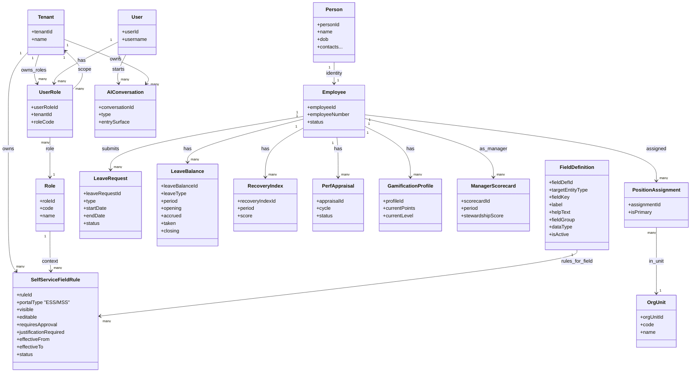

# ESS-MSS (Employee & Manager Self-Service) - MermaidER Domain Diagram

## Domain Overview

The ESS-MSS domain manages self-service portal configuration, controlling what fields employees and managers can view and edit in their self-service portals. It provides role-based field visibility and editability rules, approval workflows, and integration with all other domains for a unified self-service experience.

## Mermaid Class Diagram

## Key-Value Mappings

### Entity Mappings

| Entity | Purpose | Client-Side Representation |
|--------|---------|---------------------------|
| `Tenant` | Multi-tenant isolation | Company-specific self-service configurations |
| `User` | Portal user | User accessing ESS or MSS portal |
| `Role` | User role definition | Role selector in configuration, role-based access |
| `UserRole` | User-role assignment | User's assigned roles, role-based permissions |
| `FieldDefinition` | Field metadata | Field configuration UI, field library |
| `SelfServiceFieldRule` | Field access rules | Rule configuration form, field visibility/editing controls |
| `Person` | Personal information | Personal info section in ESS portal |
| `Employee` | Employee data | Employee profile in ESS, team member view in MSS |
| `OrgUnit` | Organizational context | Department selector, org chart in MSS |
| `PositionAssignment` | Position data | Position info in ESS, team structure in MSS |
| `LeaveRequest` | Leave management | Leave requests in ESS, team leave in MSS |
| `LeaveBalance` | Leave balances | Balance display in ESS |
| `RecoveryIndex` | Recovery tracking | Recovery score in ESS, team recovery in MSS |
| `PerfAppraisal` | Performance data | Self-appraisals in ESS, team appraisals in MSS |
| `GamificationProfile` | Gamification data | Points and badges in ESS |
| `ManagerScorecard` | Manager metrics | Stewardship dashboard in MSS |
| `AIConversation` | AI assistance | AI copilot in ESS/MSS portals |

### Relationship Mappings

| Relationship | Meaning | User Experience Impact |
|--------------|---------|------------------------|
| `Tenant → UserRole` | Company owns role assignments | Each company has their own role structure |
| `User → UserRole` | User has roles | User's roles determine portal access and permissions |
| `Role → UserRole` | Roles assigned to users | Role-based field access rules apply |
| `Tenant → FieldDefinition` | Company defines fields | Company can customize which fields exist |
| `Tenant → SelfServiceFieldRule` | Company configures rules | Each company sets their own self-service rules |
| `FieldDefinition → SelfServiceFieldRule` | Rules apply to fields | Each field has rules for visibility/editing |
| `Role → SelfServiceFieldRule` | Rules are role-specific | Different roles see/edit different fields |
| `Employee → LeaveRequest` | Employee submits requests | ESS portal shows employee's own requests |
| `Employee → LeaveBalance` | Employee views balances | ESS portal shows employee's own balances |
| `Employee → PerfAppraisal` | Employee views appraisals | ESS shows employee's own appraisals |
| `Employee → ManagerScorecard` | Manager views scorecard | MSS shows manager's stewardship metrics |

## First-Person Flow: Using Self-Service Portals

I'm an employee using the Employee Self-Service (ESS) portal. Here's my journey through the ESS-MSS domain:

**Step 1: Accessing My Portal**
I log into the system and see my ESS portal dashboard. The system determines my role (Employee) and applies the appropriate SelfServiceFieldRule configurations. Based on my role, certain fields are visible, some are editable, and some require approval if I change them.

**Step 2: Viewing My Profile**
I navigate to my profile page. I see various sections: Personal Information, Contact Details, Emergency Contacts, Dependents, Qualifications, etc. Each field's visibility is controlled by FieldDefinition and SelfServiceFieldRule. I can see which fields I can edit (they have edit buttons) and which are read-only (grayed out or no edit option).

**Step 3: Editing My Contact Information**
I want to update my phone number. I see the phone number field has an edit button, indicating it's editable according to the SelfServiceFieldRule for my role. I click edit, update the number, and save. Since this field doesn't require approval, the change is saved immediately and I see a confirmation message.

**Step 4: Requesting a Change That Needs Approval**
I want to update my address. When I click edit, I see that this field requires approval (requiresApproval flag is true). I make the change and provide a justification (since justificationRequired is true). I submit the change, and it goes into a pending state. I see a notification that my change is awaiting HR approval.

**Step 5: Viewing My Leave Information**
I navigate to the Leave section. I can see my leave balances (read-only, as configured), and I can create new leave requests. The system shows me which leave-related fields I can view and which actions I can take, all controlled by SelfServiceFieldRule configurations for the Employee role.

**Step 6: Accessing Manager Self-Service (MSS)**
As a manager, I also have access to the Manager Self-Service (MSS) portal. When I log in, the system recognizes my Manager role and shows me additional fields and features. I can see my team's leave requests, performance appraisals, and stewardship metrics - all controlled by MSS-specific SelfServiceFieldRule configurations.

**Step 7: Approving Team Member Changes**
In my MSS portal, I see pending approval requests from my team members. These are changes they made to fields that require manager approval. I can review each change, see the justification they provided, and approve or reject it. The approval workflow is integrated with the SelfServiceFieldRule system.

**Step 8: Viewing Team Information**
In my MSS portal, I can view aggregated team information - team leave balances, recovery indices, performance trends. The fields I can see are controlled by MSS-specific rules. I can see more information than individual employees see in their ESS portals, but still within configured limits.

**Step 9: HR Configuration**
As an HR administrator, I configure FieldDefinition records to define which fields exist in the system. Then I create SelfServiceFieldRule records that specify, for each field and each role, whether it's visible, editable, requires approval, etc. I can set effective dates so rules change over time, and I can enable/disable rules as needed.

**Step 10: Role-Based Field Access**
The system applies SelfServiceFieldRule configurations based on my UserRole assignments. If I have multiple roles (e.g., both Employee and Manager), the system combines the rules appropriately, showing me the union of fields I can access from all my roles.

## Client-Side Analogies

### Like a Customizable Employee Portal Where HR Controls What You Can See and Edit
Think of the ESS-MSS domain like a configurable employee portal system:

- **Field Definitions** are like form field definitions in a form builder. HR defines which fields exist in the system - name, email, phone, address, etc. Each field has metadata like label, data type, and help text.

- **Self-Service Field Rules** are like permission settings for each field. For each field and each role, HR configures: Can employees see this field? Can they edit it? Does editing require approval? Do they need to provide justification? It's like a detailed permissions matrix.

- **Employee Self-Service (ESS)** is like a personal dashboard where employees can view and update their own information. What they can see and edit is controlled by the field rules. It's like a customizable profile page where HR decides what's visible and editable.

- **Manager Self-Service (MSS)** is like an enhanced dashboard for managers. They can see their own information plus team information, but still within configured limits. It's like having additional tabs or sections that employees don't see.

- **Approval Workflows** are like a change request system. When an employee edits a field that requires approval, the change goes into a pending state. Managers or HR review and approve/reject it. It's like a ticket system for profile changes.

- **Role-Based Access** is like different user interfaces for different roles. An employee sees one set of fields, a manager sees more, and HR sees everything. It's like having different views of the same data based on your role.

### Interactive Self-Service Experience
When you use the self-service portals:

- **Profile Page** shows your information organized into sections. Each field displays with appropriate controls - edit buttons for editable fields, read-only display for non-editable fields, and lock icons for fields that require approval.

- **Edit Forms** open when you click edit on a field. The form shows the current value, allows you to change it, and if approval is required, shows an approval workflow indicator and justification field.

- **Pending Changes** appear in a "Pending Approvals" section if you have changes awaiting approval. You can see the status, who's reviewing it, and cancel the request if needed.

- **Manager Dashboard** (MSS) shows additional sections like "Team Overview", "Pending Approvals", and "Team Analytics". These sections are only visible to users with manager roles.

- **Field Indicators** show visual cues about field permissions. Editable fields have edit icons, read-only fields are grayed out, and approval-required fields show a lock icon or approval badge.

- **Role Selector** (if you have multiple roles) lets you switch between ESS and MSS views. When you switch, the available fields and features change based on the selected role's field rules.

- **Configuration Interface** (for HR) shows a matrix view where HR can configure field rules. Rows are fields, columns are roles, and cells show the permissions (visible, editable, requires approval, etc.). It's like a spreadsheet for configuring permissions.

## What This Domain Solves

### Business Problems

1. **Configurable Self-Service**
   - HR controls what employees can see and edit
   - No hard-coding of field permissions
   - Flexible configuration without code changes

2. **Role-Based Access Control**
   - Different field access for different roles
   - Employees see limited fields, managers see more
   - Supports complex organizational structures

3. **Approval Workflows**
   - Sensitive fields require approval before changes
   - Justification requirements for certain changes
   - Audit trail of all changes and approvals

4. **Unified Portal Experience**
   - Single portal integrates all domains
   - Consistent experience across features
   - Role-appropriate information display

5. **Compliance and Control**
   - HR maintains control over data access
   - Ensures sensitive information is protected
   - Supports regulatory compliance requirements

6. **Reduced HR Workload**
   - Employees can update their own information
   - Reduces routine data entry for HR
   - Approval workflows ensure quality

### User Experience Improvements

1. **Clear Field Permissions**
   - Visual indicators show what's editable
   - Clear distinction between view and edit
   - Transparent approval requirements

2. **Easy Self-Service**
   - Simple forms for common updates
   - Inline editing where appropriate
   - Quick access to own information

3. **Manager Insights**
   - Managers see team information
   - Stewardship metrics and analytics
   - Approval workflow management

4. **Approval Transparency**
   - Clear status of pending changes
   - Notification system for approvals
   - History of all changes

5. **Role-Appropriate Views**
   - Employees see employee view
   - Managers see manager view
   - HR sees full administrative view

6. **Mobile-Friendly**
   - Responsive design for mobile access
   - Easy field editing on mobile
   - Quick approvals for managers

### Technical Benefits

1. **Flexible Configuration**
   - Field definitions separate from rules
   - Rules can change over time with effective dates
   - Support for complex permission scenarios

2. **Role-Based Rule Application**
   - Rules applied based on user roles
   - Support for multiple roles per user
   - Efficient rule evaluation

3. **Integration with All Domains**
   - Works with People, Leave, Performance, etc.
   - Consistent field rule application
   - Unified portal experience

4. **Approval Workflow Engine**
   - Configurable approval requirements
   - Multiple approver support
   - Integration with notification system

5. **Audit Trail**
   - Complete history of field changes
   - Approval decision tracking
   - Compliance and reporting support

6. **Multi-Tenant Isolation**
   - Each company has their own field rules
   - No cross-tenant data access
   - Supports SaaS deployment

7. **Performance Optimization**
   - Efficient rule evaluation
   - Cached field permissions
   - Optimized for portal page loads
