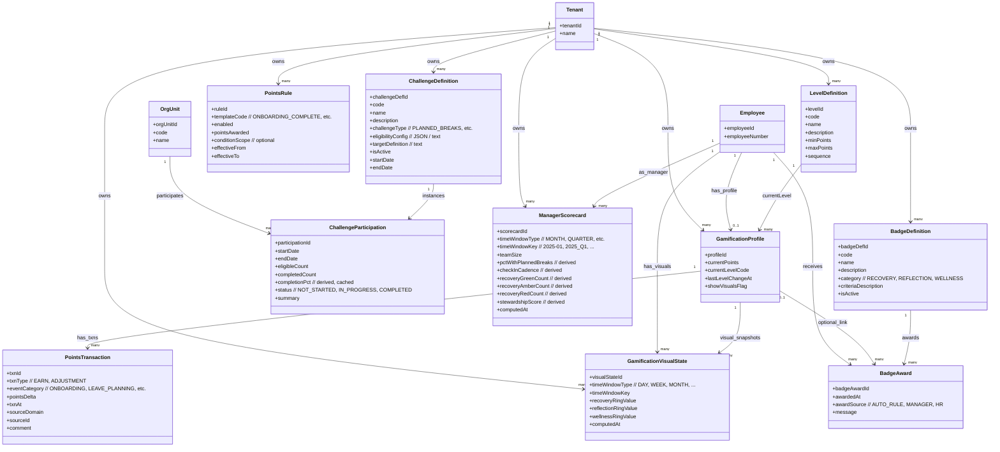

# Gamification Layer - MermaidER Domain Diagram

## Domain Overview

The Gamification Layer provides wellness-focused gamification features including points, levels, challenges, badges, and manager scorecards. It rewards healthy work behaviors like planned leave, regular check-ins, and recovery patterns while avoiding rewards for overwork or unhealthy "hustle culture".

## Mermaid Class Diagram

## Key-Value Mappings

### Entity Mappings

| Entity | Purpose | Client-Side Representation |
|--------|---------|---------------------------|
| `Tenant` | Multi-tenant isolation | Company-specific gamification rules and levels |
| `Employee` | Gamification participant | Employee name in leaderboards, profile owner |
| `OrgUnit` | Team-based challenges | Department/team challenge participation |
| `GamificationProfile` | Employee gamification state | Points display, level badge, profile dashboard |
| `PointsTransaction` | Points earned/spent | Transaction history, points feed, notification badges |
| `PointsRule` | Rules for earning points | Points rule library, rule configuration |
| `LevelDefinition` | Level definitions | Level progression bar, level badges, level descriptions |
| `ChallengeDefinition` | Challenge templates | Challenge cards, challenge library, challenge details |
| `ChallengeParticipation` | Employee challenge participation | Challenge progress tracker, completion status |
| `ManagerScorecard` | Manager stewardship metrics | Manager dashboard, stewardship score, team wellness metrics |
| `BadgeDefinition` | Badge types | Badge gallery, badge descriptions, badge requirements |
| `BadgeAward` | Badges earned | Badge collection, earned badges display, badge notifications |
| `GamificationVisualState` | Visual ring states | Recovery/reflection/wellness rings, visual dashboard |

### Relationship Mappings

| Relationship | Meaning | User Experience Impact |
|--------------|---------|------------------------|
| `Tenant → GamificationProfile` | Company owns profiles | Each company has their own gamification system |
| `Tenant → PointsRule` | Company defines point rules | Each company sets their own point earning rules |
| `Tenant → LevelDefinition` | Company defines levels | Each company has their own level structure |
| `Employee → GamificationProfile` | Employee has profile | Employee sees their own points, level, and progress |
| `GamificationProfile → PointsTransaction` | Profile tracks transactions | Employee sees history of all point transactions |
| `PointsRule → PointsTransaction` | Rules generate transactions | Points automatically awarded based on rules |
| `LevelDefinition → GamificationProfile` | Profiles have levels | Employee's level displayed based on points |
| `Tenant → ChallengeDefinition` | Company defines challenges | Company creates wellness challenges |
| `ChallengeDefinition → ChallengeParticipation` | Challenges have participants | Employees join and participate in challenges |
| `OrgUnit → ChallengeParticipation` | Teams participate in challenges | Department-wide challenges for team wellness |
| `Tenant → BadgeDefinition` | Company defines badges | Company creates badge types |
| `BadgeDefinition → BadgeAward` | Badges are awarded | Employees earn badges based on criteria |
| `Employee → BadgeAward` | Employee receives badges | Employee sees their badge collection |
| `Employee → ManagerScorecard` | Managers have scorecards | Managers see their stewardship metrics |
| `GamificationProfile → GamificationVisualState` | Profiles have visual states | Employee sees recovery/reflection/wellness rings |

## First-Person Flow: Earning Points and Leveling Up

I'm an employee participating in the gamification system. Here's my journey through the Gamification Layer domain:

**Step 1: Getting My Gamification Profile**
When I first join the company, a GamificationProfile is created for me. I start with zero points and at the first level (e.g., "Wellness Beginner"). I can choose whether to show gamification visuals on my profile - some people prefer a more private experience, while others enjoy the gamification elements.

**Step 2: Earning My First Points**
I complete my onboarding process, and the system automatically awards me points based on a PointsRule. I see a notification: "You earned 50 points for completing onboarding!" The points are recorded as a PointsTransaction with details about what I did to earn them. I can see this in my points history feed.

**Step 3: Planning My Leave**
I request leave well in advance (planned break). The system recognizes this as a wellness-positive behavior and awards me points through the "LEAVE_PLANNING" event category. I see another notification and my points increase. The system encourages planned breaks over last-minute requests.

**Step 4: Participating in Regular Check-Ins**
I complete regular check-ins with my manager. Each check-in earns me points for engagement and reflection. The system tracks my check-in cadence and rewards consistency. I see my points accumulating over time as I maintain this healthy habit.

**Step 5: Leveling Up**
As my points accumulate, I reach the threshold for the next level. The system automatically levels me up and I see a celebration animation: "Congratulations! You've reached Level 2: Wellness Enthusiast!" My profile updates to show my new level badge, and I can see how many points I need for the next level.

**Step 6: Joining a Challenge**
I see a company-wide challenge: "Planned Breaks Challenge" - encouraging employees to take planned leave over the next quarter. I join the challenge, creating a ChallengeParticipation record. I can see my progress in the challenge dashboard - how many planned breaks I've taken, my completion percentage, and how I compare to others.

**Step 7: Earning Badges**
As I participate in wellness activities, I earn badges. For example, when I complete my first planned leave request, I earn the "Planned Break Champion" badge. I see a badge notification with the badge icon and description. My badge collection grows, and I can view all my earned badges in a gallery.

**Step 8: Viewing My Visual Rings**
The system computes my GamificationVisualState, showing three rings: Recovery Ring (based on leave patterns), Reflection Ring (based on check-ins), and Wellness Ring (overall wellness engagement). I see these as circular progress indicators on my dashboard, like fitness tracker rings. I can see my progress toward completing each ring for the current time period.

**Step 9: Tracking My Points History**
I can view my complete PointsTransaction history. I see a feed of all my point-earning activities: onboarding completion, planned leave requests, check-ins, challenge completions, and any manual adjustments. Each transaction shows the date, points earned, category, and source. It's like a transaction history in a banking app.

**Step 10: Seeing Manager Scorecards**
As a manager, I can view my ManagerScorecard which shows my stewardship metrics. I see metrics like what percentage of my team takes planned breaks, our average check-in cadence, and how many team members have green recovery scores. My stewardship score reflects how well I'm supporting my team's wellness.

**Step 11: Participating in Team Challenges**
My department joins a team challenge focused on recovery. We work together toward a team goal, and I can see our collective progress. The challenge shows our team's completion percentage and how we compare to other teams. It creates a sense of camaraderie around wellness.

**Step 12: Viewing My Progress Dashboard**
I have a gamification dashboard that shows everything at a glance: my current points, my level, my progress to the next level, my active challenges, my badge collection, and my visual rings. It's like a personal wellness gaming dashboard that motivates me to maintain healthy work patterns.

## Client-Side Analogies

### Like a Fitness App Gamification System with Points, Levels, and Achievements
Think of the Gamification Layer like a wellness-focused fitness app or gaming platform:

- **Points** are like experience points (XP) in a game. You earn them for completing wellness-positive activities. They accumulate over time and are displayed prominently on your profile. It's like a score that reflects your engagement with wellness practices.

- **Levels** are like character levels in an RPG game. As you earn more points, you level up. Each level has a name (e.g., "Wellness Beginner", "Recovery Champion", "Wellness Master") and unlocks at certain point thresholds. You see a progress bar showing how close you are to the next level.

- **Challenges** are like fitness challenges or quests in a game. You join challenges that encourage specific wellness behaviors (e.g., "Take 4 planned breaks this quarter"). You see your progress, completion status, and can compare with others. It's like a mission or quest system.

- **Badges** are like achievements or trophies. You earn badges for specific accomplishments - completing your first planned leave, maintaining regular check-ins, participating in challenges. Your badge collection is displayed like a trophy case, showing all your wellness achievements.

- **Visual Rings** are like the activity rings in Apple Watch or Fitbit. You have three rings: Recovery (leave patterns), Reflection (check-ins), and Wellness (overall engagement). You see circular progress indicators showing how close you are to completing each ring for the current period. It's visual and motivating.

- **Points History** is like a transaction history in a banking app. You see a feed of all your point-earning activities with timestamps, amounts, and descriptions. You can scroll through to see your wellness journey over time.

- **Manager Scorecard** is like a leaderboard or dashboard for managers. It shows how well you're supporting your team's wellness - metrics like team recovery scores, check-in participation, and planned break rates. It's like a manager performance dashboard but focused on team wellness.

### Interactive Gamification Experience
When you interact with the gamification system:

- **Points Display** shows your current points prominently, often in the header or profile. You see animations when points are added, with a "+50 points" notification that fades in and out. It's satisfying and motivating.

- **Level Badge** appears next to your name or on your profile. It shows your current level with an icon and name. When you level up, you see a celebration animation with confetti or similar effects.

- **Challenge Cards** display available challenges as cards with challenge name, description, time remaining, and your progress. You can click to join or view details. Active challenges show your progress bar and completion status.

- **Badge Collection** is displayed as a grid of badge icons. Earned badges are colorful and clickable (showing details), while unearned badges are grayed out. You can filter by category (Recovery, Reflection, Wellness) and see what you need to do to earn each badge.

- **Visual Rings Dashboard** shows three circular progress indicators side-by-side. Each ring fills as you complete activities. You can click on a ring to see details about what contributes to it and how to complete it.

- **Points Feed** is a scrollable timeline showing all your point transactions. Each entry shows an icon, description, points earned, and timestamp. It's like a social media feed but for your wellness activities.

- **Manager Dashboard** (for managers) shows stewardship metrics in cards or charts. You see your stewardship score prominently, team wellness metrics, and trends over time. It helps you understand how well you're supporting your team.

## What This Domain Solves

### Business Problems

1. **Wellness Behavior Reinforcement**
   - Rewards healthy work patterns (planned breaks, regular check-ins)
   - Encourages proactive wellness behaviors
   - Creates positive reinforcement for work-life balance

2. **Employee Engagement**
   - Gamification elements increase engagement with wellness programs
   - Makes wellness tracking fun and motivating
   - Creates a sense of achievement and progress

3. **Manager Stewardship**
   - Tracks how well managers support team wellness
   - Provides metrics for manager development
   - Encourages managers to prioritize team wellness

4. **Team Wellness Culture**
   - Team challenges create shared wellness goals
   - Fosters camaraderie around healthy work practices
   - Builds a wellness-positive culture

5. **Avoiding Unhealthy Rewards**
   - System designed to NOT reward overwork or "hustle"
   - Focuses on recovery, reflection, and balance
   - Prevents gamification from encouraging burnout

6. **Privacy and Choice**
   - Employees can opt out of visual gamification elements
   - Respects individual preferences
   - Maintains focus on wellness, not competition

### User Experience Improvements

1. **Motivating Progress Tracking**
   - Visual progress indicators (points, levels, rings)
   - Clear feedback on wellness activities
   - Celebration of achievements and milestones

2. **Engaging Challenge System**
   - Fun, wellness-focused challenges
   - Progress tracking and completion status
   - Team and individual challenges

3. **Badge Collection**
   - Achievement system with visual badges
   - Clear criteria for earning badges
   - Display of earned achievements

4. **Transparent Points System**
   - Clear rules for earning points
   - Complete transaction history
   - Understanding of point values

5. **Manager Insights**
   - Stewardship metrics for managers
   - Team wellness dashboard
   - Actionable insights for supporting teams

6. **Visual Wellness Indicators**
   - Three-ring system for recovery, reflection, wellness
   - Easy-to-understand progress visualization
   - Motivational completion goals

### Technical Benefits

1. **Flexible Points System**
   - Configurable points rules
   - Event-based point awards
   - Support for various point-earning activities

2. **Level Progression**
   - Configurable level definitions
   - Automatic level calculation
   - Support for complex level structures

3. **Challenge Management**
   - Template-based challenge creation
   - Team and individual challenges
   - Progress tracking and completion logic

4. **Badge System**
   - Flexible badge definitions
   - Multiple award sources (auto, manager, HR)
   - Category-based organization

5. **Visual State Computation**
   - Time-window based calculations
   - Three-ring system computation
   - Cached visual states for performance

6. **Manager Scorecard Analytics**
   - Derived metrics computation
   - Time-window based aggregation
   - Stewardship score calculation

7. **Multi-Tenant Isolation**
   - Each company has their own gamification rules
   - No cross-tenant data access
   - Supports SaaS deployment
