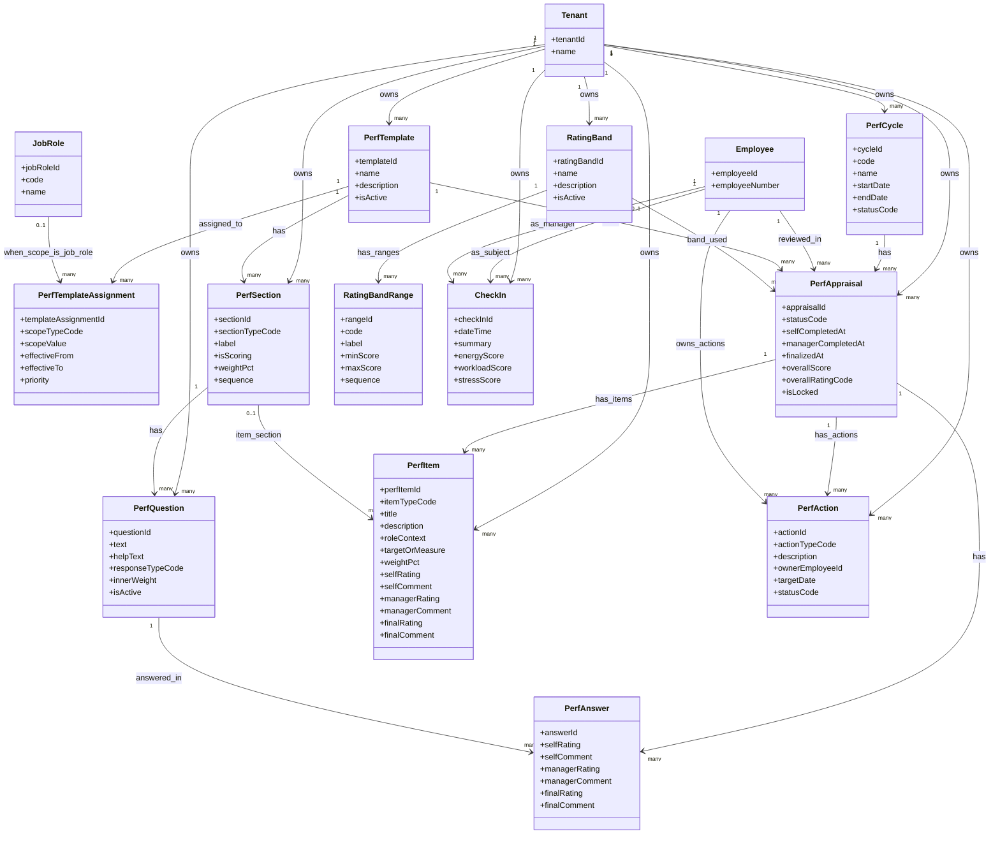

# Growth Signals (Performance & Check-Ins) - MermaidER Domain Diagram

## Domain Overview

The Growth Signals domain manages performance appraisals, check-ins, and development planning. It provides structured performance review cycles with templates, questions, KPIs/OKRs, rating systems, and regular check-ins to track employee growth, energy, workload, and stress levels.

## Mermaid Class Diagram

## Key-Value Mappings

### Entity Mappings

| Entity | Purpose | Client-Side Representation |
|--------|---------|---------------------------|
| `Tenant` | Multi-tenant isolation | Company-specific performance cycles and templates |
| `Employee` | Performance review subject | Employee name in appraisals, check-in participant |
| `JobRole` | Role-based template assignment | Role selector in template configuration |
| `PerfCycle` | Performance review period | Cycle selector, cycle dashboard, active cycle banner |
| `PerfTemplate` | Appraisal form structure | Template selector, template preview, template library |
| `PerfTemplateAssignment` | Template-to-role mapping | Template assignment rules, role-based form selection |
| `PerfSection` | Sections in appraisal form | Form sections/tabs, section navigation, section progress |
| `PerfQuestion` | Questions in sections | Question cards, question forms, help text tooltips |
| `PerfAppraisal` | Individual performance review | Appraisal card, appraisal detail page, status badge |
| `PerfAnswer` | Answers to questions | Answer fields, rating sliders, comment boxes |
| `PerfItem` | KPIs/OKRs in appraisal | KPI cards, OKR progress bars, item detail views |
| `PerfAction` | Development actions | Action items list, action tracker, completion status |
| `RatingBand` | Rating scale definition | Rating scale display, score-to-rating conversion |
| `RatingBandRange` | Rating scale ranges | Rating labels (Exceeds, Meets, Below), score ranges |
| `CheckIn` | Regular check-in sessions | Check-in form, check-in history, wellness indicators |

### Relationship Mappings

| Relationship | Meaning | User Experience Impact |
|--------------|---------|------------------------|
| `Tenant → PerfCycle` | Company defines cycles | Each company has their own performance cycles (annual, mid-year, etc.) |
| `Tenant → PerfTemplate` | Company creates templates | Templates define the structure of appraisals |
| `PerfTemplate → PerfSection` | Templates have sections | Appraisal forms organized into logical sections |
| `PerfSection → PerfQuestion` | Sections contain questions | Questions grouped by topic within sections |
| `PerfTemplate → PerfTemplateAssignment` | Templates assigned to roles | Different roles get different appraisal templates |
| `JobRole → PerfTemplateAssignment` | Roles determine templates | Employee sees template based on their job role |
| `PerfCycle → PerfAppraisal` | Cycles contain appraisals | All appraisals for a cycle grouped together |
| `Employee → PerfAppraisal` | Employee is reviewed | Employee sees their own appraisals in their dashboard |
| `PerfTemplate → PerfAppraisal` | Appraisals use templates | Appraisal form structure comes from assigned template |
| `RatingBand → PerfAppraisal` | Appraisals use rating scales | Overall rating displayed using rating band labels |
| `PerfAppraisal → PerfAnswer` | Appraisals have answers | Each question in appraisal has an answer |
| `PerfQuestion → PerfAnswer` | Questions get answered | Answers linked to specific questions |
| `PerfAppraisal → PerfItem` | Appraisals track KPIs/OKRs | Performance items shown alongside questions |
| `PerfSection → PerfItem` | Items can be in sections | KPIs organized into sections if needed |
| `PerfAppraisal → PerfAction` | Appraisals generate actions | Development actions created from appraisal |
| `Employee → PerfAction` | Employee owns actions | Employee sees their action items to complete |
| `RatingBand → RatingBandRange` | Bands have score ranges | Score ranges define rating boundaries |
| `Employee → CheckIn` | Employee participates in check-ins | Employee sees their check-in history and can create new ones |

## First-Person Flow: Participating in Performance Management

I'm an employee participating in the performance management process. Here's my journey through the Growth Signals domain:

**Step 1: Seeing an Active Performance Cycle**
I log into the system and see a notification that a new performance cycle has started - "2024 Annual Performance Review" running from January to March. I see a banner on my dashboard with key dates: self-assessment due date, manager review period, and finalization date. The system shows me my progress with a progress bar.

**Step 2: Understanding My Template**
The system assigns me a performance template based on my job role. I see a preview of the template structure - it has sections like "Core Competencies", "Goals & Objectives", "Development Areas", and "Future Planning". Each section shows how many questions it contains and whether it's scored. The system explains that I'll complete a self-assessment first, then my manager will review it.

**Step 3: Starting My Self-Assessment**
I click "Start Self-Assessment" and the appraisal form opens. It's organized into sections with a sidebar navigation. I can see my progress - "Section 1 of 4" with a progress indicator. The form is clean and easy to navigate, with save buttons so I can work on it over multiple sessions.

**Step 4: Answering Questions**
I work through each section. For each question, I see the question text, helpful guidance text, and response options. Some questions use rating scales (1-5), others are open text comments, and some are both. I provide my self-rating and comments explaining my reasoning. The system shows me character counts and validates that required fields are completed.

**Step 5: Reviewing My KPIs and OKRs**
In the "Goals & Objectives" section, I see my performance items (KPIs/OKRs) that were set at the beginning of the cycle. For each item, I can see the target, my progress, and I need to provide a self-rating and comment on my achievement. The system shows visual progress bars for quantitative goals, making it easy to see how I'm doing.

**Step 6: Completing My Self-Assessment**
After completing all sections, I review my entire self-assessment. The system shows me a summary view with all my answers. I can go back and edit any section before submitting. Once I'm satisfied, I click "Submit Self-Assessment". The system confirms submission and notifies my manager that my self-assessment is ready for review.

**Step 7: Waiting for Manager Review**
While my manager reviews my assessment, I see the status as "Under Manager Review". I can still view my submitted answers but can't edit them. The system shows me when my manager started reviewing and provides an estimated completion date based on typical review times.

**Step 8: Manager's Review and Feedback**
My manager completes their review. I receive a notification that my appraisal has been updated. When I open it, I see my manager's ratings and comments alongside my own. The system uses a side-by-side or toggle view so I can compare my self-assessment with my manager's assessment. I see areas where we agree and areas where there are differences.

**Step 9: Viewing Final Ratings**
Once the appraisal is finalized, I see my overall score and rating. The system uses the rating band to convert my score into a rating label (e.g., "Exceeds Expectations", "Meets Expectations"). I see a breakdown of how the score was calculated, showing section weights and contributions. The rating is displayed prominently with color coding (green for exceeds, yellow for meets, etc.).

**Step 10: Reviewing Development Actions**
From the appraisal, development actions have been created. I see a list of action items with descriptions, target dates, and status. Some actions are assigned to me, others to my manager or HR. I can track the progress of each action and mark them as complete when done. The system sends me reminders as target dates approach.

**Step 11: Regular Check-Ins**
Throughout the year, I participate in regular check-ins with my manager. I open the check-in form and see questions about my current energy level, workload, and stress. I use sliders to rate each on a scale, and I can add a summary comment about how things are going. The system tracks these over time, showing trends in my wellness indicators.

**Step 12: Viewing My Performance History**
I can view all my past appraisals in a timeline view. I see my performance progression over time, how my ratings have changed, and trends in my scores. The system shows me a performance trajectory graph, helping me see my growth journey. I can compare appraisals side-by-side to see improvement areas.

**Step 13: Accessing Development Resources**
Based on my appraisal results and development actions, the system suggests learning resources, training courses, or development opportunities. I see personalized recommendations that align with my development areas. I can track my development progress and see how it relates to my performance goals.

## Client-Side Analogies

### Like a Structured Performance Review System with Templates and Scoring
Think of the Growth Signals domain like a comprehensive performance management platform:

- **Performance Cycles** are like academic semesters or fiscal quarters. You have defined periods when performance reviews happen, with clear start and end dates. It's like a project timeline but for performance evaluation.

- **Performance Templates** are like form templates in a document editor. Each template defines the structure - what sections to include, what questions to ask, how things are weighted. When you start an appraisal, the system uses your assigned template to create the form.

- **Self-Assessment** is like filling out a detailed survey about your work. You go through each question, provide ratings and comments, and submit it. It's like a self-evaluation form but more structured and comprehensive.

- **Manager Review** is like a teacher grading your assignment. Your manager sees your self-assessment, adds their own ratings and comments, and provides feedback. The system shows both perspectives side-by-side for comparison.

- **KPIs and OKRs** are like goal tracking in a project management tool. You see your objectives, your progress toward them, and you evaluate your achievement. It's visual with progress bars and status indicators.

- **Rating Bands** are like grade scales in school. Your numerical score gets converted to a rating label (Exceeds, Meets, Below) based on defined ranges. It's like getting an A, B, or C grade based on your percentage score.

- **Development Actions** are like tasks in a to-do list app. From your appraisal, action items are created that you need to complete. You see them in a task list with due dates and status tracking.

- **Check-Ins** are like wellness check-ins in a health app. You regularly report on your energy, workload, and stress levels. The system tracks these over time and shows trends, like a fitness tracker but for work wellness.

### Interactive Performance Management Experience
When you interact with the performance system:

- **Appraisal Form** is a multi-section form with progress tracking. You see a sidebar showing all sections, your current section highlighted, and a progress bar at the top. Each section can be saved independently, so you can work on it over time.

- **Question Cards** display each question as a card with the question text, help text (expandable), and response fields. For rating questions, you see sliders or radio buttons. For text questions, you see text areas with character counts.

- **Side-by-Side Comparison** shows your self-assessment and manager's assessment in a comparison view. You can toggle between "My View" and "Manager's View" or see them side-by-side. Differences are highlighted so you can see where perspectives align or differ.

- **Score Breakdown** displays how your overall score was calculated. You see each section's contribution, weights, and how they combine to the final score. It's like a detailed grade breakdown showing how each assignment contributed to your final grade.

- **Action Items Dashboard** shows all your development actions in a kanban-style board or list view. You can filter by status (Not Started, In Progress, Completed), sort by due date, and see which actions are overdue.

- **Check-In Form** is a quick form with sliders for energy, workload, and stress (1-10 scales), plus a text area for summary. It's designed to be fast to complete - just a few minutes. After submitting, you see your historical trends in a graph.

- **Performance Timeline** shows all your appraisals in a chronological view. You can click on any appraisal to see details, and you see visual indicators of your performance trajectory over time.

## What This Domain Solves

### Business Problems

1. **Structured Performance Management**
   - Replaces ad-hoc performance reviews with standardized processes
   - Ensures consistent evaluation across all employees
   - Supports multiple performance cycles (annual, mid-year, quarterly)

2. **Template-Based Reviews**
   - Allows different appraisal structures for different roles
   - Ensures relevant questions for each job function
   - Maintains consistency within role groups

3. **360-Degree Feedback Process**
   - Captures both self-assessment and manager review
   - Enables comparison of perspectives
   - Supports calibration and alignment discussions

4. **Goal and KPI Tracking**
   - Integrates KPIs and OKRs into performance reviews
   - Tracks progress toward objectives
   - Links performance to business goals

5. **Development Planning**
   - Converts appraisal insights into actionable development plans
   - Tracks development action completion
   - Supports career growth and skill development

6. **Wellness Integration**
   - Regular check-ins track energy, workload, and stress
   - Identifies employees who might be struggling
   - Supports proactive wellness interventions

7. **Rating Standardization**
   - Consistent rating scales across the organization
   - Clear definition of what each rating means
   - Supports fair and objective evaluation

### User Experience Improvements

1. **Guided Self-Assessment**
   - Step-by-step process with clear instructions
   - Progress tracking and save functionality
   - Help text and examples for each question

2. **Transparent Review Process**
   - Clear visibility of review status
   - Side-by-side comparison of self and manager assessments
   - Detailed score breakdowns

3. **Visual Performance Tracking**
   - Timeline view of performance history
   - Trend graphs showing performance over time
   - Progress indicators for goals and actions

4. **Actionable Development Plans**
   - Clear action items with owners and due dates
   - Progress tracking for development activities
   - Integration with learning resources

5. **Quick Check-Ins**
   - Fast, simple check-in process
   - Visual trend tracking
   - Wellness indicator monitoring

6. **Mobile-Friendly Experience**
   - Responsive design for mobile access
   - Quick check-ins from mobile devices
   - Notifications for important milestones

### Technical Benefits

1. **Flexible Template System**
   - Configurable templates with sections and questions
   - Role-based template assignment
   - Support for various question types and response formats

2. **Weighted Scoring**
   - Configurable section and question weights
   - Automatic score calculation
   - Support for complex scoring models

3. **Temporal Tracking**
   - Historical performance data
   - Trend analysis capabilities
   - Performance trajectory visualization

4. **Action Management**
   - Task creation and tracking
   - Assignment and ownership
   - Status and completion tracking

5. **Rating Band System**
   - Flexible rating scale definitions
   - Score-to-rating conversion
   - Support for different rating models

6. **Check-In Analytics**
   - Time-series data collection
   - Trend analysis and pattern recognition
   - Wellness indicator computation
