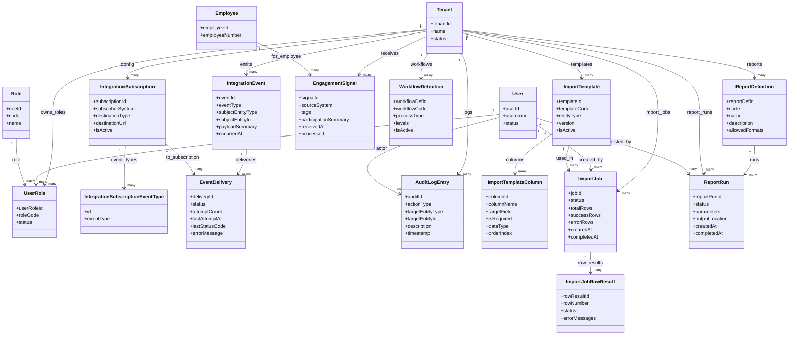

# Integrations and NFR (Non-Functional Requirements) - MermaidER Domain Diagram

## Domain Overview

The Integrations and NFR domain manages system integrations, event-driven architecture, audit logging, workflow definitions, data imports, and reporting. It provides the infrastructure for connecting with external systems, maintaining compliance through audit trails, and supporting bulk operations and analytics.

## Mermaid Class Diagram

## Key-Value Mappings

### Entity Mappings

| Entity | Purpose | Client-Side Representation |
|--------|---------|---------------------------|
| `Tenant` | Multi-tenant isolation | Company-specific integrations and configurations |
| `User` | System user | User performing actions, requesting reports, creating imports |
| `Role` | User role | Role-based access to integrations and reports |
| `UserRole` | User-role assignment | User's roles determine access permissions |
| `IntegrationEvent` | System events | Event log, event monitoring dashboard |
| `IntegrationSubscription` | Event subscriptions | Subscription configuration, webhook management |
| `IntegrationSubscriptionEventType` | Event type subscriptions | Event type filters in subscriptions |
| `EventDelivery` | Event delivery tracking | Delivery status, retry management, failure logs |
| `EngagementSignal` | External engagement data | Engagement dashboard, signal processing status |
| `AuditLogEntry` | Audit trail | Audit log viewer, compliance reports |
| `WorkflowDefinition` | Workflow templates | Workflow configuration, workflow library |
| `ImportTemplate` | Import templates | Template selector, template configuration |
| `ImportTemplateColumn` | Template column mappings | Column mapping interface, field mapping |
| `ImportJob` | Import execution | Import job status, progress tracking |
| `ImportJobRowResult` | Row-level import results | Import error details, row-by-row validation |
| `ReportDefinition` | Report templates | Report library, report configuration |
| `ReportRun` | Report execution | Report generation status, download links |
| `Employee` | Employee reference | Employee data in imports, reports, events |

### Relationship Mappings

| Relationship | Meaning | User Experience Impact |
|--------------|---------|------------------------|
| `Tenant → IntegrationEvent` | Company emits events | Each company's events are isolated |
| `Tenant → IntegrationSubscription` | Company configures subscriptions | Each company sets up their own integrations |
| `IntegrationSubscription → IntegrationSubscriptionEventType` | Subscriptions filter by event type | Subscribers choose which events to receive |
| `IntegrationEvent → EventDelivery` | Events are delivered to subscribers | Each delivery attempt is tracked |
| `IntegrationSubscription → EventDelivery` | Deliveries go to subscriptions | Delivery status shown per subscription |
| `Tenant → EngagementSignal` | Company receives engagement signals | External system data integrated |
| `Employee → EngagementSignal` | Signals relate to employees | Employee engagement tracking |
| `Tenant → AuditLogEntry` | Company maintains audit logs | Compliance and security tracking |
| `User → AuditLogEntry` | Users perform audited actions | Action tracking and accountability |
| `Tenant → WorkflowDefinition` | Company defines workflows | Customizable business processes |
| `Tenant → ImportTemplate` | Company creates import templates | Template-based bulk data import |
| `ImportTemplate → ImportTemplateColumn` | Templates define column mappings | Field mapping configuration |
| `Tenant → ImportJob` | Company runs import jobs | Bulk import execution |
| `User → ImportJob` | User initiates imports | Import job ownership and tracking |
| `ImportTemplate → ImportJob` | Jobs use templates | Template-based import execution |
| `ImportJob → ImportJobRowResult` | Jobs have row results | Detailed import validation and errors |
| `Tenant → ReportDefinition` | Company defines reports | Report library and templates |
| `ReportDefinition → ReportRun` | Reports are executed | Report generation and scheduling |
| `User → ReportRun` | User requests reports | Report ownership and access |

## First-Person Flow: System Integration and Operations

I'm a system administrator managing integrations and system operations. Here's my journey through the Integrations and NFR domain:

**Step 1: Configuring Event Subscriptions**
I need to set up an integration with an external payroll system. I create an IntegrationSubscription, specifying the subscriber system name, destination URL (webhook endpoint), and destination type. I then configure which event types this subscription should receive by creating IntegrationSubscriptionEventType records. The system will deliver events like "EMPLOYEE_CREATED", "LEAVE_APPROVED", etc. to this subscription.

**Step 2: Monitoring Event Delivery**
When system events occur (like an employee being created), an IntegrationEvent is created. The system attempts to deliver this event to all active subscriptions that subscribe to this event type. Each delivery attempt creates an EventDelivery record. I can monitor the delivery status dashboard to see which events were successfully delivered and which failed, with retry counts and error messages.

**Step 3: Receiving Engagement Signals**
Our wellness partner system (ZHEP) sends engagement signals when employees participate in wellness activities. These EngagementSignal records are received and stored. The system processes them, linking them to employees and updating wellness profiles. I can see a dashboard showing received signals, processing status, and any errors.

**Step 4: Viewing Audit Logs**
All critical system actions are logged in AuditLogEntry records. When a user creates an employee, updates a leave request, or performs any audited action, an audit log entry is created. I can view the audit log to see who did what, when, and on which entity. This supports compliance and security investigations.

**Step 5: Configuring Workflows**
I need to set up a custom approval workflow for a specific process. I create a WorkflowDefinition, specifying the workflow code, process type, and approval levels. This workflow can then be used by other modules (like leave requests) to define their approval processes. The workflow definition is reusable across different entities.

**Step 6: Creating Import Templates**
I need to import employee data from a legacy system. I create an ImportTemplate for the "Employee" entity type. Then I define ImportTemplateColumn records that map CSV column names to target fields in our system. For example, "First Name" column maps to "per_first_name" field. I specify which columns are required and their data types.

**Step 7: Running an Import Job**
I upload a CSV file and select the ImportTemplate I created. The system creates an ImportJob and starts processing. I can see the job status (Running, Completed, Failed) and progress (rows processed, success count, error count). The system validates each row and creates ImportJobRowResult records showing which rows succeeded and which failed, with detailed error messages for failures.

**Step 8: Viewing Import Results**
After the import completes, I can view detailed results. I see a summary showing total rows, successful imports, and errors. I can drill down into ImportJobRowResult records to see specific row errors. I can download a report of failed rows to fix and re-import. The system provides clear feedback on what went wrong and how to fix it.

**Step 9: Defining Reports**
I need to create a standard report for HR analytics. I create a ReportDefinition, specifying the report code, name, description, and allowed output formats (PDF, Excel, CSV). This report definition becomes available in the report library for users to run.

**Step 10: Running Reports**
A user requests a report by selecting a ReportDefinition and providing parameters (date range, filters, etc.). The system creates a ReportRun and starts generating the report. The user can see the status (Queued, Running, Completed, Failed) and receives a notification when complete. They can download the report from the output location.

**Step 11: Monitoring System Health**
I regularly check the integration health dashboard. I see metrics like event delivery success rates, import job statuses, report generation times, and audit log volumes. This helps me identify issues early and ensure system reliability.

**Step 12: Troubleshooting Failed Deliveries**
When an EventDelivery fails, I can see the error message, HTTP status code, and retry count. The system automatically retries failed deliveries with exponential backoff. If deliveries continue to fail, I can investigate the subscriber system, check network connectivity, or update the subscription configuration.

## Client-Side Analogies

### Like a Notification System That Tracks Message Delivery and Retries Failed Sends
Think of the Integrations and NFR domain like a sophisticated messaging and operations platform:

- **Integration Events** are like messages or notifications that the system generates. When something important happens (employee created, leave approved), an event is created, like a notification being generated.

- **Integration Subscriptions** are like email subscriptions or webhook endpoints. External systems "subscribe" to receive certain types of events. It's like signing up for email notifications for specific topics.

- **Event Delivery** is like tracking email delivery. Each time the system tries to send an event to a subscriber, it creates a delivery record. You can see if it succeeded, failed, how many times it retried, and any error messages. It's like email delivery receipts and bounce tracking.

- **Engagement Signals** are like incoming messages from external systems. When a wellness partner sends data about employee engagement, it's received as a signal, processed, and integrated into the system. It's like receiving and processing incoming API calls.

- **Audit Logs** are like a security camera recording or activity log. Every important action is recorded with who did it, when, and what changed. You can review the log to see the complete history of system activity, like reviewing security footage.

- **Import Templates** are like data mapping configurations. You define how to map columns from a CSV file to fields in the system. It's like a translation dictionary that tells the system "when you see 'First Name' in the CSV, put it in the 'firstName' field".

- **Import Jobs** are like batch processing tasks. You upload a file, the system processes it row by row, and you see progress and results. It's like a file conversion process with detailed feedback on what succeeded and what failed.

- **Report Definitions** are like report templates or saved report configurations. You define what data to include, how to format it, and what parameters users can provide. Users can then run these reports anytime, like using a saved query in a database tool.

- **Report Runs** are like report generation tasks. When a user requests a report, a run is created, the report is generated (which might take time for large datasets), and the user gets notified when it's ready. It's like submitting a print job and waiting for it to complete.

### Interactive Operations Experience
When you interact with the operations features:

- **Integration Dashboard** shows all active subscriptions, recent events, delivery success rates, and any failures. You see health indicators (green for healthy, yellow for warnings, red for failures) and can drill down into details.

- **Event Monitor** shows a real-time or near-real-time feed of IntegrationEvents being generated. You can filter by event type, see payload summaries, and view delivery status for each event.

- **Delivery Status View** shows EventDelivery records in a table or list. You can see delivery attempts, retry counts, success/failure status, and error messages. Failed deliveries are highlighted, and you can manually retry them.

- **Import Interface** provides a file upload area, template selector, and preview of column mappings. After uploading, you see a preview of the data and can confirm before starting the import. During import, you see a progress bar and live status updates.

- **Import Results View** shows import job summary with success/error counts, and a detailed table of ImportJobRowResult records. Failed rows are highlighted with error messages. You can export failed rows to fix and re-import.

- **Report Library** displays available ReportDefinition records as cards or a list. Each report shows name, description, and allowed formats. You click to run a report, provide parameters in a form, and submit.

- **Report Status** shows your ReportRun records with status indicators. Completed reports have download links. You can see when reports were requested, completed, and download them. Large reports might take time, and you get notifications when ready.

- **Audit Log Viewer** provides a searchable, filterable interface to AuditLogEntry records. You can filter by user, action type, entity type, date range, etc. Each entry shows who, what, when, and details. It's like a detailed activity log with powerful search.

## What This Domain Solves

### Business Problems

1. **System Integration**
   - Enables integration with external systems (payroll, wellness partners, etc.)
   - Event-driven architecture for loose coupling
   - Webhook-based integrations for real-time updates

2. **Compliance and Audit**
   - Complete audit trail of all system actions
   - Supports regulatory compliance requirements
   - Security and accountability tracking

3. **Bulk Data Operations**
   - Efficient bulk import of employee data
   - Template-based imports reduce configuration time
   - Detailed validation and error reporting

4. **Reporting and Analytics**
   - Standardized report definitions
   - On-demand report generation
   - Support for multiple output formats

5. **Operational Monitoring**
   - Track integration health and delivery status
   - Monitor system operations and performance
   - Identify and resolve issues quickly

6. **Workflow Management**
   - Configurable workflow definitions
   - Reusable workflow templates
   - Support for complex business processes

### User Experience Improvements

1. **Integration Management**
   - Easy subscription configuration
   - Clear delivery status visibility
   - Simple troubleshooting tools

2. **Import Experience**
   - Template-based imports reduce errors
   - Clear column mapping interface
   - Detailed error reporting for fixes

3. **Report Access**
   - Easy-to-use report library
   - Clear report status and notifications
   - Quick download of completed reports

4. **Audit Transparency**
   - Searchable audit logs
   - Clear action tracking
   - Compliance reporting support

5. **Operational Visibility**
   - Dashboard views of system health
   - Real-time status monitoring
   - Proactive issue identification

### Technical Benefits

1. **Event-Driven Architecture**
   - Loose coupling between systems
   - Scalable event processing
   - Support for multiple subscribers

2. **Reliable Delivery**
   - Retry mechanisms for failed deliveries
   - Delivery status tracking
   - Error handling and recovery

3. **Flexible Integration**
   - Support for webhooks, APIs, and other patterns
   - Configurable event filtering
   - Multi-tenant isolation

4. **Efficient Imports**
   - Batch processing capabilities
   - Row-level validation and error tracking
   - Support for large datasets

5. **Scalable Reporting**
   - Asynchronous report generation
   - Support for large datasets
   - Multiple output formats

6. **Audit Trail**
   - Complete action history
   - Efficient querying and filtering
   - Compliance-ready data structure

7. **Multi-Tenant Isolation**
   - Each company's integrations are isolated
   - No cross-tenant data access
   - Supports SaaS deployment

8. **Performance Optimization**
   - Efficient event processing
   - Cached report definitions
   - Optimized import and report generation
