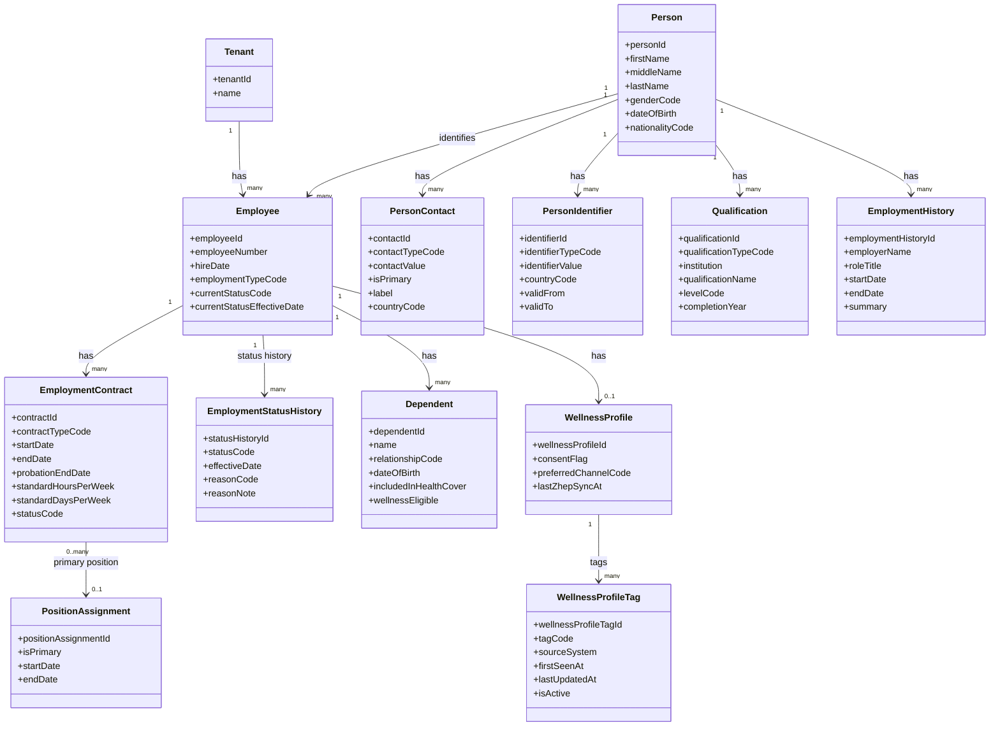

# People Core - MermaidER Domain Diagram

## Domain Overview

The People Core domain manages the fundamental identity and employment information for all individuals in the system. It tracks the journey from being a Person (with personal details) to becoming an Employee (with employment records), including contracts, status changes, dependents, qualifications, and wellness profiles.

## Mermaid Class Diagram

## Key-Value Mappings

### Entity Mappings

| Entity | Purpose | Client-Side Representation |
|--------|---------|---------------------------|
| `Tenant` | Multi-tenant isolation | Company selector, data isolation boundary |
| `Person` | Core identity information | Personal information section in profile, name display everywhere |
| `PersonContact` | Contact details | Email/phone fields in profile, contact card, directory listing |
| `PersonIdentifier` | Government IDs, passports | ID document section, verification status badge |
| `Employee` | Employment record | Employee badge, employee number display, hire date in profile |
| `EmploymentContract` | Contract terms | Contract details page, employment terms card, contract history timeline |
| `EmploymentStatusHistory` | Status change tracking | Status timeline, employment history, status change notifications |
| `Dependent` | Family members | Dependents list in profile, benefits enrollment, wellness eligibility |
| `Qualification` | Education credentials | Education section in profile, qualifications card, resume view |
| `EmploymentHistory` | Previous work experience | Work experience timeline, resume section, career history |
| `WellnessProfile` | Wellness program participation | Wellness dashboard, consent toggle, program enrollment status |
| `WellnessProfileTag` | Wellness categorization | Wellness tags/badges, health engagement indicators |
| `PositionAssignment` | Link to org structure | Position badge, org chart location, reporting structure |

### Relationship Mappings

| Relationship | Meaning | User Experience Impact |
|--------------|---------|------------------------|
| `Tenant → Employee` | Tenant owns employees | Each company sees only their employees |
| `Person → Employee` | Person becomes employee | One person can have multiple employment records (rehires) |
| `Person → PersonContact` | Person has contacts | Multiple contact methods shown in profile, primary contact highlighted |
| `Person → PersonIdentifier` | Person has IDs | ID verification status, document upload section |
| `Person → Qualification` | Person has education | Education section in profile, qualifications filter in search |
| `Person → EmploymentHistory` | Person has work history | Resume view, career timeline, experience matching |
| `Employee → EmploymentContract` | Employee has contracts | Contract history, current contract details, renewal reminders |
| `Employee → EmploymentStatusHistory` | Employee status changes | Status timeline, employment lifecycle tracking |
| `Employee → Dependent` | Employee has dependents | Dependents management, benefits enrollment, family wellness |
| `Employee → WellnessProfile` | Employee wellness data | Wellness dashboard access, program participation status |
| `WellnessProfile → WellnessProfileTag` | Profile has tags | Wellness categorization, personalized recommendations |
| `EmploymentContract → PositionAssignment` | Contract linked to position | Position shown in contract details, org structure integration |

## First-Person Flow: From Person to Employee

I'm a new hire going through the onboarding process. Here's my journey through the People Core domain:

**Step 1: Creating My Person Record**
When I first interact with the system, HR creates a Person record for me. This contains my fundamental identity: my name, date of birth, gender, and nationality. The system asks me to provide this information through an onboarding form, similar to filling out a job application. I see a clean, step-by-step form that guides me through entering my personal details.

**Step 2: Adding My Contact Information**
Next, I add my contact details. I can add multiple contact methods - my primary email, phone number, and maybe an alternative phone. The system shows me a list of my contacts with a star indicating which one is primary. I can update these anytime through my self-service portal, and the system immediately reflects the changes across all areas where my contact info appears.

**Step 3: Providing Identification Documents**
I upload my identification documents - my national ID, passport, or driver's license. The system stores these as PersonIdentifiers with validity dates. I see a document management section where I can view all my uploaded IDs, see their validity status, and get reminders when they're about to expire. The system shows green checkmarks for verified documents.

**Step 4: Entering My Qualifications**
I add my educational qualifications - my degrees, certifications, and professional licenses. For each qualification, I specify the institution, qualification name, level, and completion year. The system displays these in a timeline view, showing my educational journey. This information helps with role matching and career development planning.

**Step 5: Adding My Employment History**
I provide details about my previous work experience. I add each previous employer, my role title, start and end dates, and a summary of my responsibilities. The system creates an EmploymentHistory timeline that shows my career progression. This helps HR understand my background and supports performance discussions.

**Step 6: Becoming an Employee**
Once my Person record is complete, HR creates an Employee record for me. I'm assigned a unique employee number (like "EMP-2024-00123") that will be my identifier throughout my employment. The system shows me a welcome screen with my employee number and a link to my new employee profile.

**Step 7: Creating My Employment Contract**
HR creates my first EmploymentContract, specifying my contract type (permanent, fixed-term, etc.), start date, end date (if applicable), probation period, and standard working hours. I can view my contract details in a dedicated section, see all terms clearly laid out, and download a PDF copy. The system sends me notifications about contract milestones, like when my probation period ends.

**Step 8: Tracking My Employment Status**
As my employment progresses, my status changes are tracked in EmploymentStatusHistory. When I complete probation, my status changes from "PROBATION" to "ACTIVE". When I get promoted, it might change to reflect my new role. I see a timeline view showing all status changes with dates and reasons, like a career progression story.

**Step 9: Managing My Dependents**
I can add my dependents - my spouse, children, or other family members who are covered under my benefits. For each dependent, I specify their name, relationship to me, date of birth, and whether they're included in health coverage or wellness programs. The system shows me a family tree view, and I can see which dependents are eligible for wellness programs.

**Step 10: Setting Up My Wellness Profile**
I'm invited to participate in the wellness program. I create my WellnessProfile, giving consent to participate and selecting my preferred communication channel (email, SMS, app notifications). The system shows me a wellness dashboard where I can see my wellness tags - categories like "ACTIVE", "HEALTH_CONSCIOUS", or "STRESS_MANAGEMENT" that are automatically assigned based on my engagement with wellness activities.

**Step 11: Viewing My Complete Profile**
Now, when I view my profile, I see a comprehensive view of all my information. There's a personal information section, contact details, qualifications, work history, current contract, employment status, dependents, and wellness profile - all organized in tabs or sections. I can edit certain fields through self-service, while others require HR approval.

## Client-Side Analogies

### Like Filling Out a Job Application That Becomes Your Employee Profile
Think of the People Core domain like a comprehensive job application form that transforms into your permanent employee profile:

- **Person Information** is like the first page of a job application - your name, date of birth, and basic identity details. Once entered, this becomes the foundation of your profile.

- **Contact Information** is like providing your email and phone on a contact form. The system remembers your preferred contact method and uses it for all communications.

- **Identification Documents** are like uploading your ID for verification. The system stores these securely and shows verification status with visual indicators (green checkmarks for verified, yellow for pending).

- **Qualifications and Employment History** are like the education and experience sections of a resume. The system displays these in a timeline format, showing your career progression visually.

- **Employee Record** is like getting your employee badge or ID card. Once created, you have an official employee number that identifies you throughout the system.

- **Employment Contract** is like receiving your offer letter and contract documents. You can view all terms, see important dates (probation end, contract renewal), and download copies.

- **Status History** is like a career timeline or employment record. You can see when you started, when you completed probation, any promotions, and all status changes in chronological order.

### Profile Management Experience
When you interact with your profile:

- **Personal Information Tab** shows your core identity details in a clean form layout, with edit buttons for fields you can modify yourself.

- **Contact Details Section** displays all your contact methods as cards, with a primary contact highlighted. You can add new contacts, set one as primary, or remove old ones.

- **Documents Section** shows your uploaded IDs as document cards with status badges (Verified, Pending, Expired). You can upload new documents, view existing ones, and see expiration reminders.

- **Qualifications Timeline** displays your education as a vertical timeline, with each qualification as a card showing institution, degree, and year. You can add new qualifications or edit existing ones.

- **Employment History** shows your previous jobs in a timeline format, with company names, roles, and date ranges. This looks like a LinkedIn profile's experience section.

- **Current Contract Card** displays your active contract details prominently - contract type, dates, working hours, and probation status. Important milestones are highlighted.

- **Status Timeline** shows your employment status changes as a vertical timeline with dates and reasons. Each status change is a milestone marker.

- **Dependents List** shows your family members as cards with their details and benefit coverage status. You can add, edit, or remove dependents (subject to approval).

- **Wellness Profile Dashboard** shows your wellness participation status, consent toggle, preferred channel, and wellness tags as badges. It's like a health app profile showing your wellness journey.

## What This Domain Solves

### Business Problems

1. **Identity Management**
   - Maintains a single source of truth for person and employee identity
   - Supports multiple employment records for the same person (rehires)
   - Ensures data consistency across all modules

2. **Employment Lifecycle Tracking**
   - Complete history of employment status changes
   - Contract management with milestone tracking
   - Supports compliance and audit requirements

3. **Comprehensive Employee Records**
   - All employee information in one place
   - Easy access to qualifications, experience, and history
   - Supports talent management and career development

4. **Wellness Integration**
   - Links employee records to wellness programs
   - Tracks wellness participation and engagement
   - Enables personalized wellness recommendations

5. **Multi-Tenant Data Isolation**
   - Each company's employee data is completely isolated
   - No risk of cross-tenant data access
   - Supports SaaS deployment

### User Experience Improvements

1. **Unified Profile View**
   - All employee information accessible from one profile page
   - Organized in logical sections with easy navigation
   - Visual timeline views for history and progression

2. **Self-Service Capabilities**
   - Employees can update their own contact information
   - Easy document upload and management
   - Transparent view of employment status and contract details

3. **Onboarding Experience**
   - Step-by-step onboarding wizard
   - Clear guidance on required information
   - Progress tracking and completion status

4. **Document Management**
   - Centralized document storage
   - Expiration tracking and reminders
   - Verification status visibility

5. **Family Management**
   - Easy dependent management
   - Clear benefit coverage visibility
   - Wellness eligibility tracking

### Technical Benefits

1. **Flexible Person-Employee Relationship**
   - Supports one person with multiple employment records
   - Handles rehires and contract workers
   - Maintains historical data integrity

2. **Temporal Data Support**
   - Effective dates on all entities
   - Historical queries and reporting
   - Audit trail for all changes

3. **Wellness System Integration**
   - Seamless connection to wellness programs
   - Tag-based categorization
   - Cross-system data synchronization

4. **Scalability**
   - Efficient queries for large employee populations
   - Optimized for profile page rendering
   - Supports thousands of employees per tenant

5. **Data Quality**
   - Validation rules for contact information
   - Document verification workflows
   - Data completeness tracking
