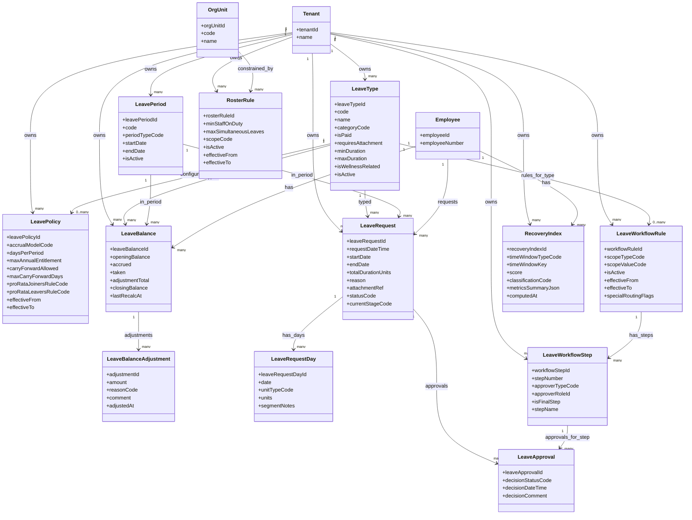

# Rhythms (Leave & Absence) - MermaidER Domain Diagram

## Domain Overview

The Rhythms domain manages all aspects of employee leave and absence, from leave type definitions and policies to balance tracking, request workflows, approvals, and recovery index calculations. It ensures employees can plan time off while maintaining operational coverage and wellness-focused leave patterns.

## Mermaid Class Diagram

## Key-Value Mappings

### Entity Mappings

| Entity | Purpose | Client-Side Representation |
|--------|---------|---------------------------|
| `Tenant` | Multi-tenant isolation | Company-specific leave policies and types |
| `Employee` | Leave requestor | Employee name in leave requests, balance owner |
| `OrgUnit` | Organizational context | Department-based roster rules, team leave calendar |
| `LeaveType` | Types of leave | Leave type dropdown in request form, leave type cards |
| `LeavePolicy` | Accrual and entitlement rules | Policy details in balance view, entitlement calculator |
| `LeavePeriod` | Time periods for leave | Period selector, balance period tabs, annual leave calendar |
| `LeaveBalance` | Current leave balances | Balance cards showing available days, balance dashboard |
| `LeaveBalanceAdjustment` | Manual balance changes | Adjustment history, admin adjustment form |
| `LeaveRequest` | Leave requests | Request cards in list view, request detail page, calendar events |
| `LeaveRequestDay` | Individual days in request | Calendar view showing specific dates, day-by-day breakdown |
| `LeaveWorkflowRule` | Approval workflow rules | Workflow configuration, routing logic |
| `LeaveWorkflowStep` | Steps in approval process | Approval steps progress bar, step-by-step approval UI |
| `LeaveApproval` | Approval decisions | Approval history, pending approvals list, decision notifications |
| `RosterRule` | Staffing constraints | Roster conflict warnings, minimum coverage indicators |
| `RecoveryIndex` | Wellness recovery tracking | Recovery score display, wellness dashboard, recovery trends |

### Relationship Mappings

| Relationship | Meaning | User Experience Impact |
|--------------|---------|------------------------|
| `Tenant → LeaveType` | Company defines leave types | Each company has their own leave types (sick, vacation, etc.) |
| `Tenant → LeavePolicy` | Company sets policies | Policies determine how leave accrues and entitlements |
| `Tenant → LeavePeriod` | Company defines periods | Annual, quarterly, or monthly leave periods |
| `LeaveType → LeavePolicy` | Policies apply to types | Each leave type has specific accrual rules |
| `LeaveType → LeaveBalance` | Balances tracked by type | Separate balance for each leave type (sick, vacation, etc.) |
| `LeaveType → LeaveRequest` | Requests specify type | Employee selects leave type when requesting |
| `LeavePeriod → LeaveBalance` | Balances within periods | Balance shown per period (e.g., 2024 annual leave) |
| `Employee → LeaveBalance` | Employee owns balances | Employee sees their own balances in dashboard |
| `LeaveBalance → LeaveBalanceAdjustment` | Manual adjustments tracked | HR can adjust balances with audit trail |
| `Employee → LeaveRequest` | Employee creates requests | Employee sees their own requests and can create new ones |
| `LeaveRequest → LeaveRequestDay` | Requests contain specific days | Calendar view shows which days are requested |
| `LeaveType → LeaveWorkflowRule` | Workflows defined per type | Different approval workflows for different leave types |
| `LeaveWorkflowRule → LeaveWorkflowStep` | Workflows have steps | Multi-step approval process (manager → HR → final) |
| `LeaveRequest → LeaveApproval` | Requests get approvals | Approval status shown in request detail |
| `OrgUnit → RosterRule` | Departments have roster rules | Roster constraints prevent too many people off at once |
| `Employee → RecoveryIndex` | Recovery tracked per employee | Employee sees their recovery score and trends |

## First-Person Flow: Requesting and Managing Leave

I'm an employee who wants to take time off. Here's my journey through the Rhythms domain:

**Step 1: Viewing My Leave Balances**
I start by checking my leave balances. I open the leave dashboard and see cards for each leave type - Annual Leave, Sick Leave, Personal Leave, etc. Each card shows my opening balance, how much I've accrued this period, how much I've taken, and my current available balance. The system shows this in a clear, visual format with progress bars and color coding (green for good balance, yellow for low, red for exhausted).

**Step 2: Understanding Leave Policies**
Before requesting leave, I can view the policies that apply to me. I see my accrual rate (e.g., 1.25 days per month), maximum annual entitlement, carry-forward rules, and any special conditions. The system explains these policies in plain language, so I understand exactly how my leave works.

**Step 3: Checking Leave Periods**
I see which leave period I'm in - for example, "2024 Annual Leave Period" running from January 1 to December 31. I can see my balance for the current period and any carry-forward from previous periods. The system shows me a timeline view of all periods and my balances across them.

**Step 4: Creating a Leave Request**
I decide to request time off. I click "Request Leave" and see a form. First, I select the leave type from a dropdown (Annual Leave, Sick Leave, etc.). The system shows me my available balance for that type right next to the selector. Then I select my start and end dates using a calendar picker. As I select dates, the system calculates the total duration and shows it prominently.

**Step 5: Specifying Leave Days**
The system breaks down my request into individual days. I can see a calendar view with my selected dates highlighted. For each day, I can specify if it's a full day or half day, and add notes if needed (e.g., "Morning appointment"). The system shows me which days are weekends or holidays, and asks if I want to include them.

**Step 6: Adding Reason and Attachments**
I enter a reason for my leave request. For certain leave types (like medical leave), the system requires an attachment. I can upload a document directly in the form. The system validates the file type and size, and shows a preview once uploaded.

**Step 7: Checking Roster Conflicts**
Before submitting, the system checks for roster conflicts. If too many people from my department are already off on those dates, I see a warning. The system shows me who else is off and suggests alternative dates. I can still submit, but my manager will see the conflict.

**Step 8: Submitting the Request**
I submit my request. The system immediately shows me the approval workflow - who needs to approve it and in what order. I see a progress bar with steps like "Submitted" → "Manager Review" → "HR Approval" → "Approved". I receive a confirmation email with my request details.

**Step 9: Tracking Approval Status**
I can track my request status in real-time. I see notifications when it moves to the next approval step. In my leave requests list, each request shows its current status with color-coded badges (Pending, Approved, Rejected, Cancelled). I can click on any request to see the full approval history with timestamps and comments.

**Step 10: Manager Approval Process**
My manager receives a notification about my request. They see my request details, my current balance, and any roster conflicts. They can approve, reject, or request more information. If they approve, the request moves to the next step. If they reject, I get a notification with their reason.

**Step 11: Balance Updates**
Once my request is approved, my leave balance is automatically updated. The system deducts the requested days from my available balance. I can see this reflected immediately in my balance dashboard. If I cancel an approved request, the balance is restored.

**Step 12: Viewing Leave History**
I can view my complete leave history - all past and current requests in a timeline or list view. I can filter by leave type, status, or date range. Each request shows the full journey from submission to completion, including all approvals and any adjustments.

**Step 13: Recovery Index Calculation**
Behind the scenes, the system calculates my Recovery Index based on my leave patterns. It looks at how I'm using my leave - am I taking regular breaks? Am I planning ahead? The system computes a score that reflects my recovery and wellness patterns. I can see this in my wellness dashboard as a recovery ring or score.

**Step 14: HR Adjustments**
Sometimes HR needs to adjust my balance - maybe I had leave from before the system, or there's a special circumstance. I can see all adjustments in my balance history, with reasons and timestamps. The system maintains a complete audit trail of all balance changes.

## Client-Side Analogies

### Like a Vacation Booking System with Balance Tracking and Manager Approval
Think of the Rhythms domain like a sophisticated vacation booking platform combined with a leave management system:

- **Leave Balances** are like your vacation account balance. You see how many days you have available, how many you've used, and how many you'll accrue. It's like a bank account statement but for time off.

- **Leave Types** are like different categories of bookings. Just like a travel site has "Hotels", "Flights", and "Car Rentals", you have "Annual Leave", "Sick Leave", and "Personal Leave" - each with its own rules and balances.

- **Leave Requests** are like booking a trip. You select your dates, specify details, and submit for confirmation. The system shows you a calendar view of your requested dates, just like a hotel booking calendar.

- **Approval Workflow** is like a multi-step booking confirmation. Instead of instant confirmation, your request goes through approval steps - your manager reviews it first, then HR, then it's confirmed. You see progress updates at each step.

- **Roster Rules** are like availability checks. Just like a booking system checks if a hotel room is available, the system checks if enough staff are available to cover your absence.

- **Leave Calendar** shows all your leave requests as calendar events, color-coded by status (pending in yellow, approved in green, rejected in red). You can see your team's leave calendar too, like a shared team calendar.

- **Balance Dashboard** is like a financial dashboard but for leave. You see all your leave types as cards, each showing available balance, usage, and trends. It's visual and easy to understand at a glance.

### Interactive Leave Management Experience
When you interact with the leave system:

- **Balance Cards** display each leave type with a circular progress indicator showing how much you've used vs. available. Hovering shows detailed breakdown (opening, accrued, taken, closing).

- **Request Form** is a step-by-step wizard. As you fill it out, the system validates in real-time - checking your balance, calculating duration, and showing conflicts. It's like an intelligent form that guides you.

- **Calendar View** shows your leave requests as colored blocks on a calendar. You can see overlapping requests, gaps in your leave, and plan better. It's like Google Calendar but specifically for leave.

- **Approval Inbox** (for managers) shows pending approvals as cards with employee name, dates, duration, and leave type. One-click approve/reject with optional comments. It's like an email inbox but for leave approvals.

- **Recovery Score** appears as a visual indicator (like a ring or gauge) showing your recovery index. Green means good recovery patterns, amber means moderate, red means you might be overworking. It's like a fitness tracker but for work-life balance.

- **Notifications** appear as toast messages or in-app notifications when your request status changes, when you get a new approval request (if you're a manager), or when your balance is adjusted. It's like push notifications from a mobile app.

## What This Domain Solves

### Business Problems

1. **Leave Management Automation**
   - Eliminates manual leave tracking spreadsheets
   - Automates balance calculations and accruals
   - Reduces administrative overhead

2. **Approval Workflow Management**
   - Ensures proper authorization for leave requests
   - Maintains audit trail of all approvals
   - Supports complex multi-step approval processes

3. **Operational Coverage**
   - Prevents staffing shortages through roster rules
   - Enables proactive planning of team leave
   - Maintains minimum staffing levels

4. **Wellness-Focused Leave Patterns**
   - Tracks recovery index to encourage healthy leave usage
   - Identifies employees who might be overworking
   - Promotes planned breaks and work-life balance

5. **Policy Compliance**
   - Enforces company leave policies automatically
   - Ensures proper accrual calculations
   - Handles pro-rata calculations for joiners and leavers

6. **Multi-Tenant Isolation**
   - Each company has its own leave types and policies
   - No cross-tenant data access
   - Supports SaaS deployment

### User Experience Improvements

1. **Transparent Balance Tracking**
   - Clear visibility of available leave balances
   - Real-time balance updates
   - Historical balance tracking

2. **Easy Request Creation**
   - Intuitive calendar-based date selection
   - Automatic duration calculation
   - Real-time validation and conflict detection

3. **Approval Visibility**
   - Real-time status updates
   - Clear approval workflow visualization
   - Notification system for status changes

4. **Calendar Integration**
   - Visual calendar view of all leave
   - Team leave calendar for planning
   - Conflict detection and warnings

5. **Recovery Insights**
   - Visual recovery index display
   - Wellness-focused leave recommendations
   - Pattern recognition for healthy leave usage

6. **Self-Service Capabilities**
   - Employees can view balances and request leave independently
   - Managers can approve/reject with one click
   - Reduced dependency on HR for routine tasks

### Technical Benefits

1. **Flexible Policy Engine**
   - Supports various accrual models
   - Handles complex policy rules
   - Temporal policy management with effective dates

2. **Workflow Automation**
   - Configurable approval workflows
   - Role-based routing
   - Special routing flags for exceptions

3. **Accurate Balance Calculations**
   - Automatic accrual calculations
   - Pro-rata handling for partial periods
   - Carry-forward logic

4. **Roster Management**
   - Department-based roster rules
   - Conflict detection algorithms
   - Minimum coverage enforcement

5. **Recovery Index Computation**
   - Automated calculation based on leave patterns
   - Time-window based analysis (daily, weekly, monthly)
   - Wellness classification and scoring

6. **Audit and Compliance**
   - Complete audit trail of all requests and approvals
   - Balance adjustment tracking
   - Historical data for reporting
