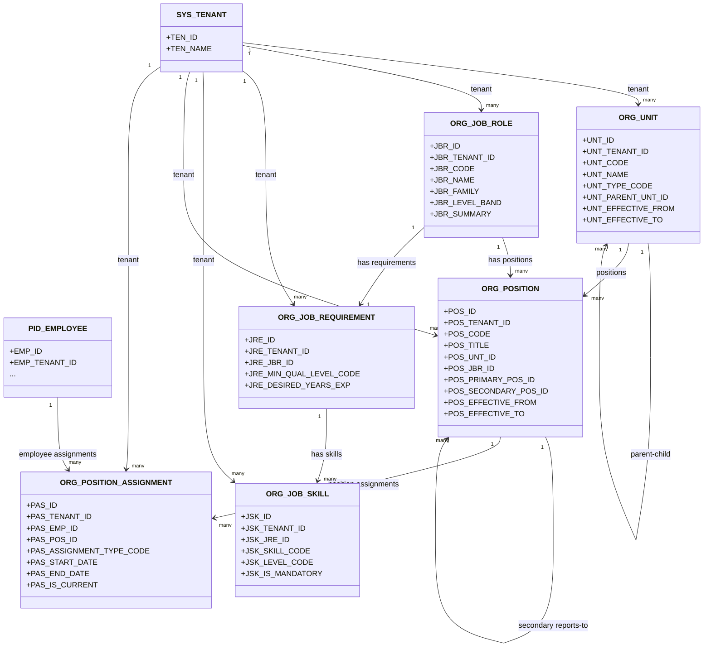

# Work Lattice - MermaidER Domain Diagram

## Domain Overview

The Work Lattice domain manages organizational structure, job roles, positions, and employee assignments. It provides the foundation for understanding reporting relationships, job requirements, and organizational hierarchy.

## Mermaid Class Diagram

## Key-Value Mappings

### Entity Mappings

| Entity | Purpose | Client-Side Representation |
|--------|---------|---------------------------|
| `SYS_TENANT` | Multi-tenant isolation | Company/organization selector in header |
| `ORG_UNIT` | Organizational hierarchy | Tree view in org chart, department dropdowns |
| `ORG_JOB_ROLE` | Job role definitions | Job role selector when creating positions, role library page |
| `ORG_JOB_REQUIREMENT` | Qualification requirements | Requirements section in job posting, role detail page |
| `ORG_JOB_SKILL` | Required skills for roles | Skills checklist in job requirements, skill tags |
| `ORG_POSITION` | Specific positions in org | Position cards in org chart, position detail pages |
| `ORG_POSITION_ASSIGNMENT` | Employee-to-position links | "My Position" badge, assignment history timeline |
| `PID_EMPLOYEE` | Employee reference | Employee profile, assignment owner |

### Relationship Mappings

| Relationship | Meaning | User Experience Impact |
|--------------|---------|------------------------|
| `SYS_TENANT → ORG_UNIT` | Tenant owns org units | Each company sees only their org structure |
| `ORG_UNIT → ORG_UNIT` | Parent-child hierarchy | Nested tree view, breadcrumb navigation |
| `ORG_UNIT → ORG_POSITION` | Units contain positions | Positions grouped by department in org chart |
| `ORG_JOB_ROLE → ORG_POSITION` | Positions based on roles | Role template pre-fills position details |
| `ORG_JOB_ROLE → ORG_JOB_REQUIREMENT` | Roles have requirements | Requirements shown when viewing role details |
| `ORG_JOB_REQUIREMENT → ORG_JOB_SKILL` | Requirements specify skills | Skills checklist in job postings |
| `ORG_POSITION → ORG_POSITION` | Reporting relationships | Org chart shows reporting lines, manager views |
| `PID_EMPLOYEE → ORG_POSITION_ASSIGNMENT` | Employees assigned to positions | "My Team" view for managers, position history |
| `ORG_POSITION → ORG_POSITION_ASSIGNMENT` | Positions have assignments | Position detail shows current and past assignees |

## First-Person Flow: Building the Organizational Structure

I'm an HR administrator setting up our company's organizational structure. Here's my journey through the Work Lattice domain:

**Step 1: Creating Organizational Units**
I start by creating organizational units that represent our company structure. I create a top-level unit called "Headquarters" and then add child units like "Engineering", "Sales", and "Operations". Each unit can have sub-units, creating a hierarchical tree. The system shows me a visual org chart as I build this structure, with drag-and-drop capabilities to reorganize units.

**Step 2: Defining Job Roles**
Next, I define job roles that exist across the organization. I create roles like "Software Engineer", "Sales Manager", and "HR Coordinator". For each role, I specify the job family (e.g., "Engineering", "Sales") and level band (e.g., "Junior", "Senior", "Lead"). The system stores these as reusable templates.

**Step 3: Setting Job Requirements**
For each job role, I define the requirements. I specify minimum qualification levels, desired years of experience, and required skills. For example, a "Senior Software Engineer" role requires a bachelor's degree, 5+ years of experience, and skills like "TypeScript", "React", and "Node.js". The system presents this as a structured form with skill tags and qualification dropdowns.

**Step 4: Creating Positions**
Now I create specific positions within organizational units. I select an org unit (e.g., "Engineering Department"), choose a job role (e.g., "Senior Software Engineer"), and create a position with a unique code and title. I can set up reporting relationships by selecting a primary and secondary reporting position. The system shows me a preview of where this position fits in the org chart.

**Step 5: Assigning Employees**
Finally, I assign employees to positions. I select an employee and link them to a position, specifying the assignment type (primary, secondary, acting), start date, and optionally an end date. The system updates the org chart in real-time, showing the employee's name in their position. I can see a timeline of all position assignments for each employee.

**Step 6: Viewing the Complete Structure**
As an employee or manager, I can view the complete organizational structure. I see a visual org chart showing all units, positions, and assignments. I can click on any position to see details, requirements, and current assignee. If I'm a manager, I see my direct reports highlighted, and I can navigate up to see my manager's position.

## Client-Side Analogies

### Building a Company Directory
Think of the Work Lattice like building a company directory or organizational chart application. When you open the org chart view, you see:

- **Organizational Units** appear as expandable tree nodes, like folders in a file explorer. You can click to expand and see sub-departments nested inside.
- **Positions** appear as cards or boxes within each department, showing the position title and the name of the person currently assigned.
- **Reporting Lines** are shown as connecting lines between positions, creating a visual hierarchy from CEO down to individual contributors.
- **Job Roles** are like templates in a document editor - you select one when creating a new position, and it pre-fills the requirements and skills.

### Interactive Org Chart Experience
When you interact with the org chart:

- **Hovering** over a position shows a tooltip with quick details: job role, department, and current assignee.
- **Clicking** a position opens a detail panel on the right side, showing full position information, requirements, skills needed, and assignment history.
- **Dragging and dropping** allows HR to reorganize the structure (if you have permissions), with the system automatically updating reporting relationships.
- **Searching** lets you find any position, employee, or department quickly, with results highlighting the location in the org chart.

### Position Assignment Workflow
When assigning an employee to a position, the experience is like:

- **Selecting a job posting** - you see available positions listed with their requirements, and you can filter by department, role, or location.
- **Matching process** - the system can suggest positions based on the employee's skills and experience, highlighting good matches.
- **Assignment confirmation** - once assigned, the employee's profile updates to show their new position, and they appear in the org chart immediately.
- **History tracking** - like a resume or LinkedIn profile, you can see all past position assignments in a timeline view.

## What This Domain Solves

### Business Problems

1. **Organizational Clarity**
   - Provides a clear, visual representation of company structure
   - Eliminates confusion about reporting relationships
   - Enables quick identification of who reports to whom

2. **Job Role Standardization**
   - Creates consistent job role definitions across the organization
   - Ensures positions are created with proper requirements and skills
   - Supports talent acquisition by clearly defining what each role needs

3. **Position Management**
   - Tracks all positions in the organization, whether filled or vacant
   - Maintains historical records of position assignments
   - Supports organizational planning and restructuring

4. **Multi-Tenant Isolation**
   - Each company (tenant) has its own complete organizational structure
   - No risk of data leakage between different organizations
   - Supports SaaS deployment with multiple clients

### User Experience Improvements

1. **Visual Org Chart**
   - Interactive, zoomable organizational chart
   - Click-to-navigate hierarchy
   - Real-time updates when assignments change

2. **Smart Position Creation**
   - Job role templates pre-fill position details
   - Requirements and skills automatically populated
   - Reduces data entry time and errors

3. **Assignment History**
   - Complete timeline of employee position assignments
   - Easy to see career progression
   - Supports reporting and analytics

4. **Manager Views**
   - Managers see their team structure at a glance
   - Direct reports highlighted
   - Easy navigation to team member profiles

### Technical Benefits

1. **Flexible Hierarchy**
   - Supports unlimited depth of organizational units
   - Handles complex matrix organizations
   - Supports both primary and secondary reporting lines

2. **Temporal Tracking**
   - Effective dates on all entities support historical queries
   - Can reconstruct org structure at any point in time
   - Supports audit and compliance requirements

3. **Scalability**
   - Efficient queries for large organizational structures
   - Optimized for org chart rendering
   - Supports thousands of positions and employees

4. **Integration Ready**
   - Clear entity relationships enable integration with other modules
   - Position data feeds into performance, leave, and gamification modules
   - Supports API-based access for external systems
