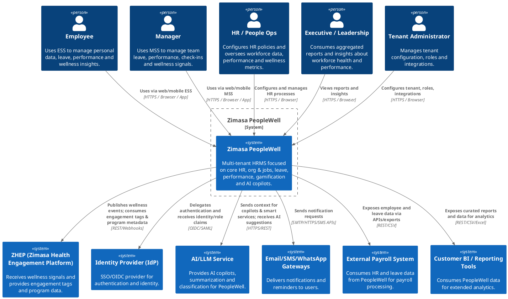

### Zimasa PeopleWell – C4 System Context (Level 1)

#### Narrative

Zimasa PeopleWell is a HRMS product within the broader Zimasa Health Engagement Platform (ZHEP). It serves as the **system of record** for employees, org structure, leave & absence, performance and wellness-oriented gamification for SME customers. PeopleWell is exposed as a **multi-tenant, API-first SaaS** application, with each customer tenant having its own org units, employees and HR policies.

Employees and managers primarily interact with PeopleWell through **Employee Self-Service (ESS)** and **Manager Self-Service (MSS)** portals. They use it to maintain personal details, manage leave and absences, complete performance reviews, run check-ins and see wellness insights such as Recovery Index, points and levels. HR/People Ops teams configure policies, manage org structure, oversee appraisals and monitor wellness signals, while executives consume aggregated insights on workforce health and performance.

PeopleWell integrates tightly with **ZHEP** by publishing wellness-relevant events (e.g. leave approvals, appraisal wellness commitments, check-in signals) and consuming high-level engagement tags and participation summaries. It delegates authentication and authorization to an **Identity Provider (IdP)** (e.g. Keycloak or another IdP) and uses external **email/SMS/WhatsApp gateways** to send notifications. For AI copilots and smart services, it calls into an **AI/LLM service** (which may be a shared Zimasa AI platform or external provider) under strict tenant and role scoping. It also exposes APIs and events that can be consumed by **external payroll or downstream HR/finance systems** to avoid duplicating payroll functionality.

---

### Actors and Systems

#### People (Actors)

* **Employee**

  * Uses PeopleWell ESS to view/update personal data, request leave, complete self-reviews, view Recovery Index and gamification status, and interact with the Employee Copilot.
* **Manager / Line Manager**

  * Uses PeopleWell MSS to approve leave, view team calendars and org charts, manage performance reviews, monitor team wellness indicators and use the Manager Insight Copilot.
* **HR / People Ops**

  * Configures org units, roles, leave policies, performance templates and workflows; manages contracts and employment status; monitors reports, Recovery Index distributions and manager scorecards.
* **Executive / Leadership**

  * Consumes aggregated reports and dashboards on headcount, leave usage, Recovery Index, performance results and high-level engagement indicators.
* **Tenant Administrator**

  * Manages tenant-level configuration, roles, access control and integration settings for PeopleWell.

#### External Systems

* **Zimasa Health Engagement Platform (ZHEP)**

  * PeopleWell **publishes** wellness-related events (leave approvals, appraisal wellness actions, check-in signals).
  * PeopleWell **consumes** engagement tags and participation summaries to enrich wellness profiles and AI insights.
* **Identity Provider (IdP) (e.g. Keycloak, SSO provider)**

  * Authenticates users (SSO/OIDC).
  * Provides identity and role claims used by PeopleWell for authorization and tenant scoping.
* **AI/LLM Service (Zimasa AI platform or external LLM provider)**

  * Receives prompts and context from PeopleWell for Employee and Manager Copilots, appraisal summarization, coaching hints and HR request classification.
  * Returns AI-generated suggestions and drafts under human review.
* **Email/SMS/WhatsApp Gateways**

  * Receive notification requests (e.g. leave approvals, reminders, wellness nudges) from PeopleWell.
  * Deliver messages to end-users via configured channels.
* **External Payroll Systems**

  * Consume PeopleWell data (e.g. employee details, leave records) via APIs/exports.
  * Optionally feed back high-level payroll-related status (e.g. payroll run completed) if integrated later.
* **Customer BI / Reporting Tools**

  * Consume exported CSV/Excel or APIs from PeopleWell for deeper analytics across HR, finance and operations.
* **Audit/Logging Platform (optional, shared)**

  * Receives audit logs and system events from PeopleWell for compliance and observability.

---

### C4 System Context Diagram (PlantUML with C4-PlantUML)

If you prefer Mermaid, we can also translate this into a Mermaid-based C4-ish diagram, but the above is directly usable with C4-PlantUML.
