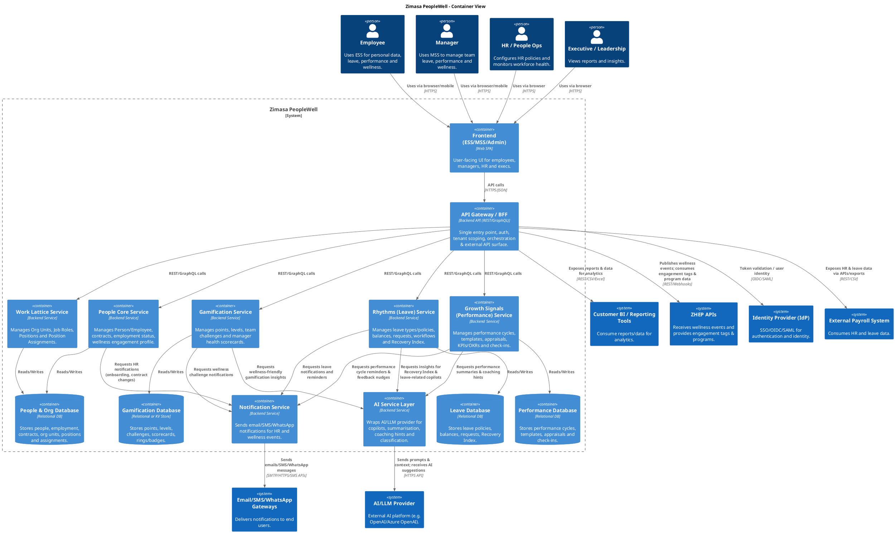

### Zimasa PeopleWell – C4 Container View (Level 2)

#### Narrative

Zimasa PeopleWell is implemented as a multi-tenant, API-first backend with a clear separation between **frontend**, **API gateway/BFF**, **domain services**, **AI/notification adapters** and **domain-specific datastores**. End users (Employees, Managers, HR, Execs) interact through a single **web frontend** (ESS/MSS/Admin), which calls an **API Gateway/BFF** responsible for authentication, tenant scoping, session management and orchestration of calls to the underlying domain services.

The core HR capabilities are split into logical backend services: **People Core**, **Work Lattice**, **Rhythms (Leave)**, **Growth Signals (Performance)** and **Gamification**. Each service owns its domain logic and data, using its own schema or database segment while sharing a common multi-tenant model. Cross-cutting behaviours such as AI copilots and notifications are handled by dedicated containers: an **AI Service Layer** which wraps the external AI/LLM provider, and a **Notification Service** that abstracts email/SMS/WhatsApp gateways. The PeopleWell backend integrates with **ZHEP** to publish wellness signals and consume engagement tags, and exposes APIs/exports for **external payroll** and **BI systems**, while delegating authentication to an external **Identity Provider (IdP)**.

---

### Containers and Responsibilities

| Container Name                       | Type                 | Responsibility                                                                                                                                          | Example Technology (generic)                                  |
| ------------------------------------ | -------------------- | ------------------------------------------------------------------------------------------------------------------------------------------------------- | ------------------------------------------------------------- |
| Frontend (ESS/MSS/Admin)             | Web SPA              | User-facing interfaces for Employees, Managers, HR, Execs (ESS/MSS/Admin consoles).                                                                     | React / Vue / Angular SPA, served via CDN                     |
| API Gateway / BFF                    | Backend service      | Single entry point for frontend; auth, tenant scoping, session handling, aggregation/orchestration of domain services; API surface to external clients. | Node.js (NestJS) / .NET / Java (Spring Boot) REST/GraphQL API |
| People Core Service                  | Backend domain svc   | Person/Employee records, contracts, employment status history, wellness engagement profile.                                                             | Node.js / .NET / Java service, REST API                       |
| Work Lattice Service                 | Backend domain svc   | Org units, job roles, positions, reporting lines, position assignments, light job requirements.                                                         | Node.js / .NET / Java service, REST API                       |
| Rhythms (Leave) Service              | Backend domain svc   | Leave types/policies, periods, balances, leave requests and workflow, team calendars, Recovery Index, leave-based wellness signals.                     | Node.js / .NET / Java service, REST API                       |
| Growth Signals (Performance) Service | Backend domain svc   | Performance cycles, templates, appraisals, KPIs/OKRs, check-ins, growth & wellness action blocks.                                                       | Node.js / .NET / Java service, REST API                       |
| Gamification Service                 | Backend domain svc   | Points, levels, team challenges, manager health scorecards, visual rings and badges state.                                                              | Node.js / .NET / Java service, REST API                       |
| AI Service Layer                     | Backend utility svc  | Wraps AI/LLM provider; handles prompts, context scoping by tenant/role, copilots, summarisation, coaching hints, HR request classification.             | Python / Node.js / .NET service calling external LLM APIs     |
| Notification Service                 | Backend utility svc  | Unified interface for email/SMS/WhatsApp notifications; templates for leave, performance, wellness nudges.                                              | Node.js / .NET service integrating with email/SMS gateways    |
| People & Org Database                | Relational datastore | Data for People Core + Work Lattice: Person, Employee, Contracts, Org Units, Positions, Assignments, job requirements.                                  | PostgreSQL / MySQL, multi-tenant schema                       |
| Leave Database                       | Relational datastore | Leave types, policies, balances, requests, Recovery Index and leave-related wellness signals.                                                           | PostgreSQL / MySQL                                            |
| Performance Database                 | Relational datastore | Performance cycles, templates, questions, appraisals, check-ins, growth & wellness actions.                                                             | PostgreSQL / MySQL                                            |
| Gamification Database                | Relational datastore | Points, levels, challenges, manager scorecards, rings/badges state.                                                                                     | PostgreSQL / MySQL / key-value store                          |
| Caching Layer (optional)             | Cache                | Caching of frequently accessed reference data (leave types, org structure, policies) and AI hints.                                                      | Redis / Memcached                                             |

**External systems referenced in the container view**

* **ZHEP APIs** – Receive wellness events (leave, appraisals, check-ins) and provide engagement tags & program metadata.
* **Identity Provider (IdP)** – Authenticates users; issues tokens validated by API Gateway/BFF.
* **AI/LLM Provider** – External AI platform used by AI Service Layer.
* **Email/SMS/WhatsApp Gateways** – External channels used by Notification Service to deliver messages.
* **External Payroll System** – Consumes People Core + Leave data via APIs/exports.
* **Customer BI / Reporting Tools** – Consume curated reports or APIs from API Gateway/BFF.

---

### Container Interactions (Summary)

* **Frontend → API Gateway/BFF**: All user interactions (ESS/MSS/Admin) are sent via HTTPS/JSON; the gateway handles auth, tenant resolution and calls into domain services.
* **API Gateway/BFF → Domain Services**: Uses REST/GraphQL or internal RPC (e.g. gRPC) to call People Core, Work Lattice, Rhythms (Leave), Growth Signals (Performance) and Gamification services.
* **Domain Services → Databases**: Each domain service reads/writes only its own database (or schema segment) following clear boundaries.
* **Domain Services → Notification Service**: When leave events, performance deadlines, or wellness milestones occur, domain services call the Notification Service to send messages.
* **Domain Services → AI Service Layer**: Performance, Leave and Gamification services invoke the AI Service Layer for copilots, summarisation, coaching hints and HR request classification.
* **AI Service Layer → AI/LLM Provider**: Sends prompts and context, receives AI suggestions; enforces tenant/role scoping.
* **Notification Service → Email/SMS/WhatsApp Gateways**: Sends outbound messages via channel-specific APIs.
* **API Gateway/BFF → ZHEP APIs**: Publishes wellness-related events and retrieves engagement tags/program data on behalf of domain services.
* **API Gateway/BFF → IdP**: Validates JWT/SSO tokens and obtains user identity/role/tenant claims.
* **External Payroll / BI Tools → API Gateway/BFF**: Consume APIs and exports for employee, leave and performance data.

---

### C4 Container Diagram (PlantUML + C4-PlantUML)

You can tweak container names/technologies to match your preferred stack (e.g. all backend in .NET or Java), but the structure and interactions above align with the MVP requirements and your module breakdown.
