Here’s a first-pass domain concept map for PeopleWell, organised by domain and then pulled together in a Mermaid diagram.

---

## 1. CoreHR Domain

### Person

* Represents a real human being, independent of tenant.
* Key attributes: `personId`, `fullName`, `dateOfBirth`, `gender`, `nationality`, contact details, IDs (national ID, tax ID, passport).

### Employee

* Represents a person as an employee within a specific tenant.
* Key attributes: `employeeId`, `employeeNumber`, `hireDate`, `employmentType`, `employmentStatus`, tenant reference.

### EmploymentContract

* Captures contractual terms for an Employee over a period.
* Key attributes: `contractId`, `contractType`, `startDate`, `endDate?`, `probationEndDate`, `workingPattern`.

### EmploymentStatusHistory

* Tracks changes in employment status over time.
* Key attributes: `statusHistoryId`, `status` (active, probation, suspended, exited), `effectiveDate`, `reason`.

### Dependent

* Represents a dependent of an Employee for wellness/eligibility (not full benefits).
* Key attributes: `dependentId`, `relationship`, `dateOfBirth`, `includedInHealthCover`.

### Qualification

* Captures education or professional qualifications of a Person.
* Key attributes: `qualificationId`, `type` (education/professional), `institution`, `qualificationName`, `level`, `yearCompleted`.

### PriorEmployment

* Summarised prior employment history for context.
* Key attributes: `priorEmploymentId`, `employerName`, `roleTitle`, `startDate`, `endDate`.

### WellnessEngagementProfile

* Stores high-level, non-clinical wellness engagement data for an Employee.
* Key attributes: `profileId`, `consentToPrograms`, `preferredChannel`, `engagementTags[]`.

---

## 2. Org & Work Lattice Domain

### OrgUnit

* Represents a structural unit within a tenant (company, department, team, cost centre).
* Key attributes: `orgUnitId`, `code`, `name`, `type`, `parentOrgUnitId`, `effectiveFrom`, `effectiveTo`.

### JobRole

* Abstract role definition, reused across positions and performance templates.
* Key attributes: `jobRoleId`, `name`, `description`, `jobFamily`, `levelBand`.

### Position

* A concrete seat in the org structure.
* Key attributes: `positionId`, `code`, `title`, `primaryReportsToPositionId`, `secondaryReportsToPositionId?`, `orgUnitId`, `jobRoleId`.

### PositionAssignment

* Assignment of an Employee to a Position over time.
* Key attributes: `assignmentId`, `employeeId`, `positionId`, `isPrimary`, `startDate`, `endDate`.

### JobRequirement

* High-level requirements associated with a JobRole.
* Key attributes: `jobRequirementId`, `jobRoleId`, `minQualificationLevel`, `requiredSkills[]`, `desiredYearsExperience`.

---

## 3. Leave & Rhythms Domain

### LeaveType

* Configurable type of leave.
* Key attributes: `leaveTypeId`, `name`, `category`, `isPaid`, `requiresAttachment`, `minDuration`, `maxDuration`, `isWellnessRelated`.

### LeavePolicy

* Policy configuration for a LeaveType within a tenant.
* Key attributes: `leavePolicyId`, `leaveTypeId`, `accrualModel`, `daysPerPeriod`, `maxAnnualEntitlement`, `carryForwardAllowed`, `maxCarryForward`, `proRataRule`.

### LeavePeriod

* Defines the active leave accounting period for a tenant.
* Key attributes: `leavePeriodId`, `name`, `startDate`, `endDate`, `type` (calendar/fiscal).

### LeaveBalance

* Tracks leave balances per employee, type and period.
* Key attributes: `leaveBalanceId`, `employeeId`, `leaveTypeId`, `leavePeriodId`, `opening`, `accrued`, `taken`, `adjustments`, `closing`.

### LeaveRequest

* Represents a request for leave by an Employee.
* Key attributes: `leaveRequestId`, `employeeId`, `leaveTypeId`, `startDate`, `endDate`, `partialDayInfo`, `reason`, `status`, `submittedAt`, `approvedBy`, `approvedAt`.

### RosterRule

* Simple capacity rule for an OrgUnit.
* Key attributes: `rosterRuleId`, `orgUnitId`, `minStaffOnDuty`, `maxSimultaneousLeaves`.

### RecoveryIndex

* Computed wellness metric based on leave usage and spacing.
* Key attributes: `employeeId`, `periodId`, `indexValue`, `status` (green/amber/red), `calculatedAt`.

### LeaveWellnessSignal

* Aggregate/anonymised signals sent to ZHEP.
* Key attributes: `signalId`, `type` (underUse, overUse, noBreak), `orgUnitId?`, `periodId`, `payload`.

---

## 4. Performance & Growth Signals Domain

### PerfCycle

* Defines a performance appraisal cycle.
* Key attributes: `perfCycleId`, `code`, `name`, `startDate`, `endDate`, `status`.

### PerfTemplate

* Template for appraisals tied to JobRole or family.
* Key attributes: `perfTemplateId`, `name`, `jobRoleId?`, `jobFamily?`.

### PerfSection

* Section within a performance template (e.g. KPIs, OKRs, Values).
* Key attributes: `perfSectionId`, `templateId`, `name`, `isScoring`, `weightPercent`, `order`.

### PerfQuestion

* Question within a non-KPI section (e.g. Self Reflection, Values).
* Key attributes: `perfQuestionId`, `sectionId`, `text`, `helpText`, `responseType` (TEXT/RATING/RATING+TEXT), `weightWithinSection?`.

### RatingBand

* Defines rating band scale for a tenant.
* Key attributes: `ratingBandId`, `name`, `minScore`, `maxScore`, `label`.

### PerfAppraisal

* Employee’s appraisal for a given cycle.
* Key attributes: `perfAppraisalId`, `employeeId`, `perfCycleId`, `templateId`, `status`, `overallScore`, `overallRatingBandId`, `finalisedAt`.

### PerfAnswer

* Answer to a specific PerfQuestion within an appraisal.
* Key attributes: `perfAnswerId`, `appraisalId`, `questionId`, `selfRating`, `selfComment`, `managerRating`, `managerComment`, `finalRating`, `finalComment`.

### KPIItem

* KPI entry within the KPI section of an appraisal.
* Key attributes: `kpiItemId`, `appraisalId`, `title`, `description`, `target`, `weightPercent`, `selfRating`, `managerRating`, `finalRating`.

### OKRInitiative

* Initiative/project within the OKR section.
* Key attributes: `okrInitiativeId`, `appraisalId`, `name`, `objective`, `roleDescription`, `weightPercent`, `selfRating`, `managerRating`, `finalRating`.

### GrowthWellnessAction

* Agreed actions at end of appraisal (performance, learning, wellness).
* Key attributes: `growthActionId`, `appraisalId`, `type` (performance/L&D/wellness), `description`, `isWellness`, `status`.

### CheckIn

* 1:1 check-in record outside formal appraisals.
* Key attributes: `checkInId`, `employeeId`, `managerId`, `dateTime`, `summary`, `energyScore`, `workloadScore`, `stressScore`.

---

## 5. Gamification Domain

### GamificationProfile

* Gamification state for an Employee in a tenant.
* Key attributes: `gamificationProfileId`, `employeeId`, `currentPoints`, `currentLevelId`, `recoveryRingValue`, `reflectionRingValue`, `wellnessRingValue`.

### PointsTransaction

* Atomic record of how/when points were earned.
* Key attributes: `pointsTransactionId`, `profileId`, `sourceType` (onboarding/leave/planning/checkIn/wellnessProgram), `points`, `occurredAt`, `referenceEntityType`, `referenceEntityId`.

### LevelDefinition

* Defines levels and thresholds.
* Key attributes: `levelId`, `name`, `minPoints`, `maxPoints`, `description`.

### ChallengeDefinition

* Definition of a team-based challenge.
* Key attributes: `challengeDefId`, `name`, `description`, `metricType` (plannedBreaks/checkInCadence/etc.), `target`, `period`.

### ChallengeParticipation

* Participation/completion of a challenge by a team.
* Key attributes: `challengeParticipationId`, `challengeDefId`, `orgUnitId` or `managerId`, `period`, `completionPercent`, `status`.

### RecognitionBadge

* Named badge awarded for behaviours.
* Key attributes: `badgeId`, `name`, `criteria`, `description`.

### EmployeeBadge

* Awarded badge instance for an Employee.
* Key attributes: `employeeBadgeId`, `employeeId`, `badgeId`, `awardedAt`.

### ManagerScorecard

* Non-punitive health stewardship summary for a manager.
* Key attributes: `managerScorecardId`, `managerId`, `period`, `plannedBreakCoverage`, `checkInCadence`, `recoveryIndexDistribution`, `score`.

---

## 6. AI & Requests Domain

### HRRequest

* Generic HR ticket raised by an Employee/Manager.
* Key attributes: `hrRequestId`, `requesterId`, `category` (leave, contract, policy, wellness, other), `subject`, `description`, `status`, `assignedTo`, `createdAt`, `updatedAt`.

### AIConversation

* A conversational session with an AI copilot (employee or manager).
* Key attributes: `aiConversationId`, `initiatorId`, `role` (employee/manager/hr), `copilotType` (Employee/Manager/Perf), `startedAt`, `endedAt`.

### AIMessage

* Individual messages in an AIConversation.
* Key attributes: `aiMessageId`, `conversationId`, `senderType` (user/AI), `content`, `createdAt`, `sourceContext[]` (e.g. leave balance, appraisal ids).

### AIClassification

* Classification result for a HRRequest or other input.
* Key attributes: `aiClassificationId`, `hrRequestId`, `predictedType`, `confidenceScore`, `suggestedQueue`, `suggestedResponseDraft?`.

---

## 7. Cross-cutting / Multi-tenant

### Tenant

* Logical customer boundary.
* Key attributes: `tenantId`, `name`, `country`, `settingsJson`.

### UserAccount

* Login identity mapped to Person and roles.
* Key attributes: `userAccountId`, `personId`, `tenantId`, `username`, `email`, `roles[]`.

---

## 8. Key Relationships (by Domain)

### CoreHR + Org

* **Person 1..* Employee** (same human can be employee in multiple tenants).
* **Employee 1..* EmploymentContract**.
* **Employee 1..* EmploymentStatusHistory**.
* **Employee 0..* Dependent**.
* **Person 0..* Qualification**.
* **Person 0..* PriorEmployment**.
* **Employee 1..1 WellnessEngagementProfile**.
* **Tenant 1..* Employee**, **Tenant 1..* OrgUnit**, **Tenant 1..* JobRole**.

### Org & Work Lattice

* **OrgUnit 1..* OrgUnit** (parent-child hierarchy).
* **OrgUnit 1..* Position**.
* **JobRole 1..* Position**.
* **JobRole 1..1 JobRequirement** (or 0..1 if optional).
* **Position 1..* PositionAssignment**.
* **Employee 0..* PositionAssignment** (primary/secondary flags).

### Leave & Rhythms

* **Tenant 1..* LeaveType**.
* **LeaveType 1..* LeavePolicy**.
* **Tenant 1..* LeavePeriod**.
* **Employee 0..* LeaveBalance**, per **LeaveType** and **LeavePeriod**.
* **Employee 0..* LeaveRequest**.
* **LeaveType 1..* LeaveRequest**.
* **LeaveBalance 0..* LeaveRequest** (requests impact balances).
* **OrgUnit 0..* RosterRule**.
* **Employee 0..* RecoveryIndex** (by period).
* **LeaveWellnessSignal** aggregates over **LeaveRequest/RecoveryIndex** and links to **OrgUnit/LeavePeriod**.

### Performance & Growth Signals

* **Tenant 1..* PerfCycle**.
* **Tenant 1..* PerfTemplate**.
* **PerfTemplate 1..* PerfSection**.
* **PerfSection 0..* PerfQuestion**.
* **Tenant 1..* RatingBand**.
* **Employee 0..* PerfAppraisal**.
* **PerfCycle 1..* PerfAppraisal**.
* **PerfTemplate 1..* PerfAppraisal** (chosen template).
* **PerfAppraisal 0..* PerfAnswer**.
* **PerfQuestion 1..* PerfAnswer** (across appraisals).
* **PerfAppraisal 0..* KPIItem**.
* **PerfAppraisal 0..* OKRInitiative**.
* **PerfAppraisal 0..* GrowthWellnessAction**.
* **Employee 0..* CheckIn** (as subject).
* **Manager (Employee) 0..* CheckIn** (as facilitator).

### Gamification

* **Employee 1..1 GamificationProfile** (per tenant).
* **GamificationProfile 0..* PointsTransaction**.
* **Tenant 1..* LevelDefinition**.
* **LevelDefinition 0..* GamificationProfile** (profiles fall into a level by points).
* **Tenant 1..* ChallengeDefinition**.
* **ChallengeDefinition 0..* ChallengeParticipation**.
* **OrgUnit or Manager 1..* ChallengeParticipation** (team-level).
* **Employee 0..* EmployeeBadge**, **RecognitionBadge 1..* EmployeeBadge**.
* **Manager (Employee) 0..* ManagerScorecard** (per period).

### AI & Requests

* **Employee/Manager/HR 0..* HRRequest** (as requester).
* **HRRequest 0..* AIClassification** (re-classified as needed).
* **Employee/Manager/HR 0..* AIConversation** (as initiator).
* **AIConversation 1..* AIMessage**.
* **AIConversation** may reference **PerfAppraisal**, **LeaveRequest**, **CheckIn**, etc., via message context.

---

## 9. Mermaid Domain Concept Diagram

This is a simplified view focusing on the most central entities and relationships (not every concept above is shown, to keep it readable):

```mermaid
classDiagram
  class Tenant {
    +tenantId
    +name
  }

  class Person {
    +personId
    +fullName
    +dateOfBirth
  }

  class Employee {
    +employeeId
    +employeeNumber
    +employmentStatus
  }

  class WellnessEngagementProfile {
    +profileId
    +consentToPrograms
    +preferredChannel
  }

  class OrgUnit {
    +orgUnitId
    +code
    +name
    +type
  }

  class JobRole {
    +jobRoleId
    +name
    +jobFamily
  }

  class Position {
    +positionId
    +code
    +title
  }

  class PositionAssignment {
    +assignmentId
    +isPrimary
    +startDate
    +endDate
  }

  class LeaveType {
    +leaveTypeId
    +name
    +category
  }

  class LeavePolicy {
    +leavePolicyId
    +accrualModel
    +maxAnnualEntitlement
  }

  class LeavePeriod {
    +leavePeriodId
    +name
    +startDate
    +endDate
  }

  class LeaveBalance {
    +leaveBalanceId
    +opening
    +accrued
    +taken
    +closing
  }

  class LeaveRequest {
    +leaveRequestId
    +startDate
    +endDate
    +status
  }

  class RecoveryIndex {
    +indexValue
    +status
  }

  class PerfCycle {
    +perfCycleId
    +code
    +status
  }

  class PerfTemplate {
    +perfTemplateId
    +name
  }

  class PerfSection {
    +perfSectionId
    +name
    +isScoring
  }

  class PerfQuestion {
    +perfQuestionId
    +text
  }

  class PerfAppraisal {
    +perfAppraisalId
    +status
    +overallScore
  }

  class PerfAnswer {
    +perfAnswerId
    +selfRating
    +managerRating
  }

  class CheckIn {
    +checkInId
    +dateTime
    +energyScore
  }

  class GamificationProfile {
    +gamificationProfileId
    +currentPoints
  }

  class PointsTransaction {
    +pointsTransactionId
    +points
    +sourceType
  }

  class LevelDefinition {
    +levelId
    +name
    +minPoints
  }

  class ChallengeDefinition {
    +challengeDefId
    +name
  }

  class ChallengeParticipation {
    +challengeParticipationId
    +completionPercent
  }

  class ManagerScorecard {
    +managerScorecardId
    +period
    +score
  }

  class HRRequest {
    +hrRequestId
    +category
    +status
  }

  class AIConversation {
    +aiConversationId
    +copilotType
  }

  class AIMessage {
    +aiMessageId
    +senderType
    +content
  }

  Tenant "1" --> "0..*" Employee : owns
  Tenant "1" --> "0..*" OrgUnit : owns
  Tenant "1" --> "0..*" JobRole : defines
  Tenant "1" --> "0..*" LeaveType : configures
  Tenant "1" --> "0..*" PerfCycle : defines
  Tenant "1" --> "0..*" PerfTemplate : defines

  Person "1" --> "0..*" Employee : employedAs
  Employee "1" --> "1" WellnessEngagementProfile : has
  Employee "1" --> "0..*" PositionAssignment : assignedTo
  Employee "1" --> "0..*" LeaveBalance : has
  Employee "1" --> "0..*" LeaveRequest : submits
  Employee "1" --> "0..*" PerfAppraisal : has
  Employee "1" --> "0..*" CheckIn : subjectOf
  Employee "1" --> "1" GamificationProfile : has
  Employee "1" --> "0..*" HRRequest : raises
  Employee "1" --> "0..*" AIConversation : initiates

  OrgUnit "1" --> "0..*" Position : contains
  OrgUnit "1" --> "0..*" ChallengeParticipation : participatesAsTeam

  JobRole "1" --> "0..*" Position : realisedBy

  Position "1" --> "0..*" PositionAssignment : occupiedBy

  LeaveType "1" --> "0..*" LeavePolicy : governedBy
  LeaveType "1" --> "0..*" LeaveBalance : trackedAs
  LeaveType "1" --> "0..*" LeaveRequest : requestedAs

  LeavePeriod "1" --> "0..*" LeaveBalance : scopedBy

  LeaveBalance "1" --> "0..*" LeaveRequest : impactedBy
  Employee "1" --> "0..*" RecoveryIndex : has

  PerfCycle "1" --> "0..*" PerfAppraisal : includes
  PerfTemplate "1" --> "0..*" PerfSection : groups
  PerfSection "1" --> "0..*" PerfQuestion : contains
  PerfAppraisal "1" --> "0..*" PerfAnswer : records
  PerfQuestion "1" --> "0..*" PerfAnswer : answeredIn

  GamificationProfile "1" --> "0..*" PointsTransaction : logs
  LevelDefinition "1" --> "0..*" GamificationProfile : categorises
  ChallengeDefinition "1" --> "0..*" ChallengeParticipation : realisedAs
  Employee "1" --> "0..*" ManagerScorecard : ifManager

  HRRequest "0..*" --> "0..*" AIConversation : referencedBy
  AIConversation "1" --> "0..*" AIMessage : contains
```

